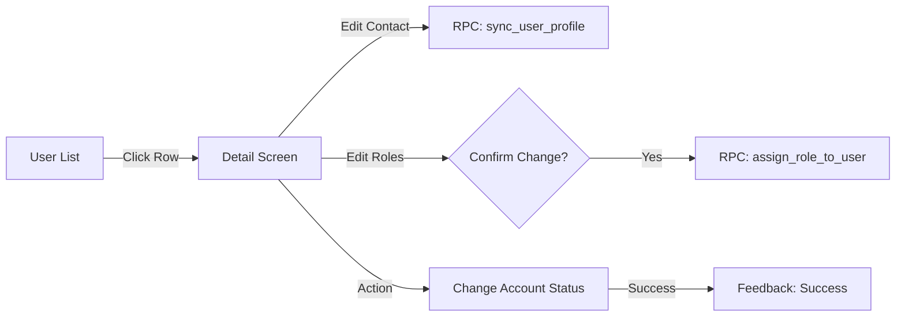

# Admin User Management: Design Specification (Enterprise Grade)

## 1. Overview
The User Management feature is a central pillar of the Fresh Home Admin ecosystem. It provides administrators with a powerful, secure, and intuitive interface to manage the platform's multi-role user base. 

The design prioritizes **actionability**, **auditability**, and **data integrity**, aligned with the zero-trust backend architecture.

---

## 2. Visual Mockups

````carousel

<!-- slide -->

````

---

## 3. Component Breakdown

### A. User List Screen
| Component | Description | UI Details |
| :--- | :--- | :--- |
| **Search Header** | Global search across name, email, and phone. | Sticky header, elevation level 2, integrated filters icon. |
| **Status Filter Chips** | Quick filter by Active, Pending, Suspended, Banned. | Horizontal scrollable list above the main table. |
| **Smart User Card** | Responsive list item showing avatar, name, primary contact. | High-visibility status badge (Color-coded). |
| **Role Badges** | Multi-tag display for users with multiple roles. | Client: Blue, Tech: Purple, Admin: Gold. |

### B. User Detail Screen
| Section | Key Fields | Interaction |
| :--- | :--- | :--- |
| **Identity Header** | Avatar, Full Name, Email, Account Status. | Direct action for "Quick Deactivate" or "Impersonate". |
| **Contact Section** | Linked Phones & Addresses. | Inline editing, toggle for "Primary" status. Calls `sync_user_profile` RPC. |
| **Roles Section** | Dynamic role list with remove/add capability. | Confirmation dialog required before calling `assign_role_to_user`. |
| **Audit Log Table** | Historical log of status changes and role assignments. | Read-only. Pulls from `booking_logs` and `user_roles.created_at`. |

---

## 4. Interaction Flow & UX



### Key Interaction Rules:
1.  **Strict Confirmations**: Any role adjustment (especially Admin promotion) or account suspension MUST trigger a bottom sheet or dialog explaining the impact.
2.  **Optimistic UI with Rollback**: Reflect status changes immediately in the UI but show a "Syncing..." state until the DB transaction is confirmed.
3.  **Audit Visibility**: The "Audit Log" card is always visible to discourage unauthorized changes and provide context for previous admin actions.

---

## 5. Design Justifications

*   **Scalability**: The sectioned card layout on the detail screen allows for future expansion (e.g., adding "Payment Methods" or "Performance Metrics" for technicians) without cluttering the UI.
*   **Security**: By strictly linking UI inputs to the `sync_user_profile` and `assign_role_to_user` RPCs, we ensure that the frontend never attempts to manipulate raw table data, maintaining the zero-trust promise.
*   **Usability**: The color-coded status badges and multi-role tags provide instant visual scanning, allowing admins to spot "Pending" technicians or "Suspended" clients at a glance.
*   **Aesthetics**: Use of the `Cairo` font family ensures a premium, localized look for the Middle Eastern market, while the high-contrast professional palette communicates trust and authority.

---

## 6. Implementation Guide for Flutter
- **Themes**: Use `Theme.of(context).cardTheme` for consistent section containers.
- **States**: Use `Bloc` or `Cubit` to manage the fetching/updating lifecycle, ensuring the `loading` state disables action buttons.
- **Components**: Recommend using `DataTable` or `ListView.separated` with Custom Row widgets for the list view to support complex badges.
