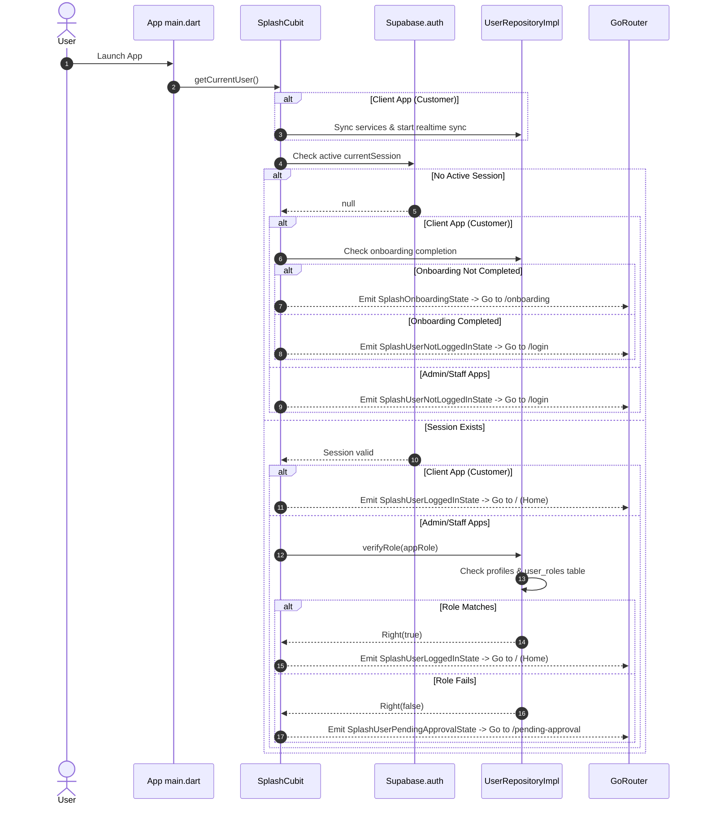
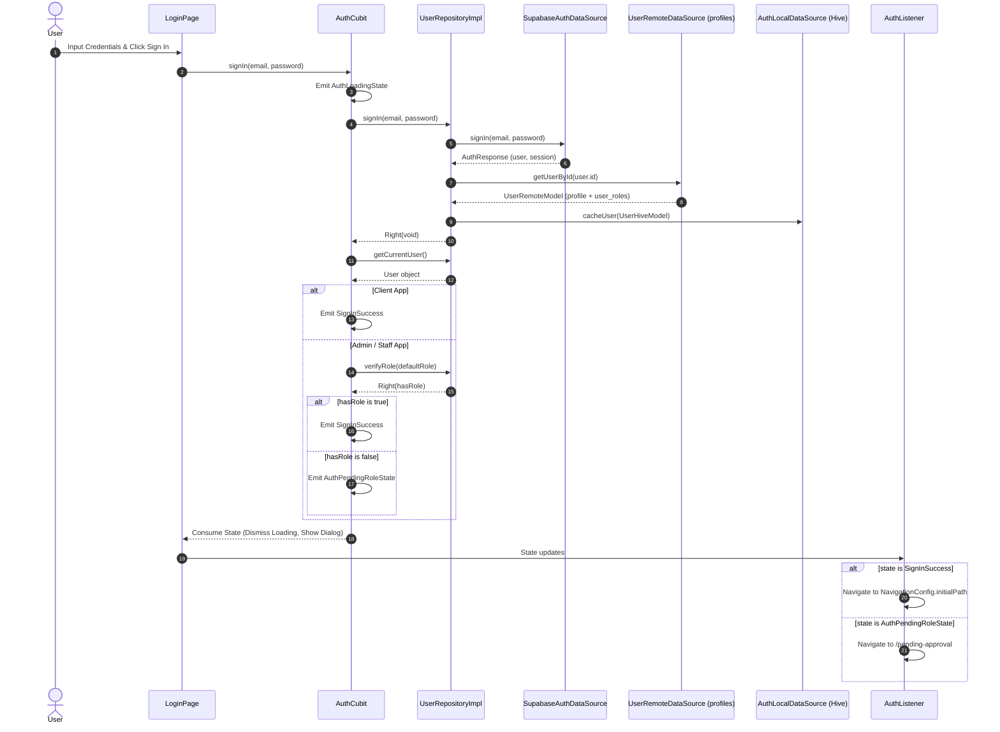
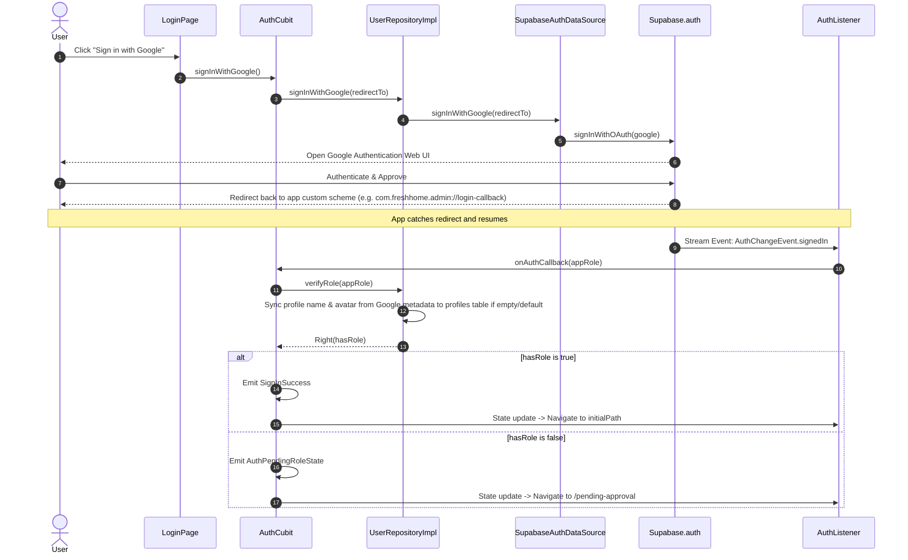
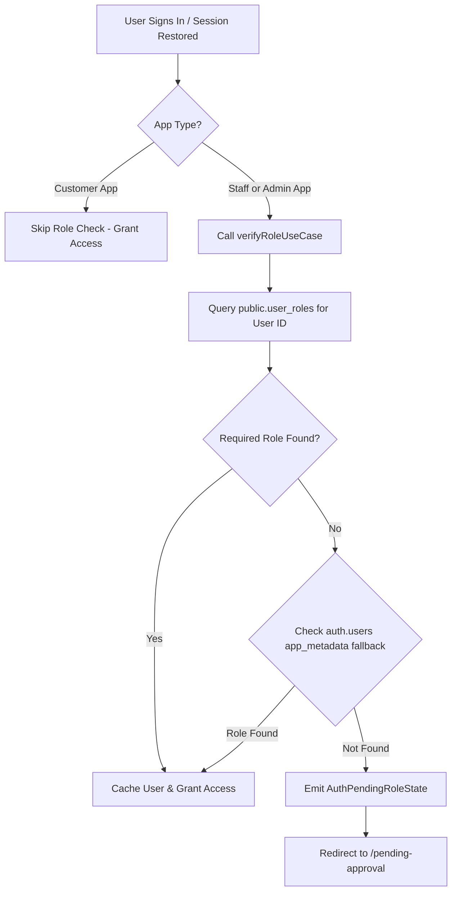

# Fresh Home: Authentication System Audit & Security Assessment

This document provides a comprehensive technical audit of the authentication and authorization systems for the **Fresh Home** monorepo—encompassing the Customer, Staff, and Admin applications.

---

## 1. Executive Summary

The Fresh Home project is structured as a Flutter monorepo interacting with a Supabase backend. It follows Clean Architecture principles, leveraging BLoC (Cubit) for state management and GetIt for dependency injection. 

While the client-side code is well-structured and maps neatly to domain logic, a deep security audit of the Supabase database schema and the routing configuration has revealed **critical security vulnerabilities** and **functional gaps** that must be resolved before production deployment:
* **Missing Row-Level Security (RLS) on Identity Tables**: Identity tables (`profiles`, `user_roles`, `user_phones`, `user_addresses`) do not have RLS enabled. This permits any user possessing the client-side anonymous key to read, update, or delete profiles, and manually escalate their privileges by inserting administrative roles.
* **Absence of GoRouter Route Guards**: The GoRouter configuration lacks active redirect guards. If unauthenticated users type or trigger a direct navigation to a protected location (such as `/admin` or `/home-tab`), the router does not redirect them back to the login page.
* **Missing Password Reset Page**: While request logic for password resets is implemented, there is no screen or routing capability in Flutter to handle the callback and update the user's password.
* **Database Trigger Drift**: The SQL migration files define the trigger function `handle_new_user()` but omit the actual `CREATE TRIGGER` statement on `auth.users`, representing a deployment drift.

---

## 2. Current Authentication Architecture

The monorepo separates authentication logic into a shared feature package (`shared_features`) and core structures inside the common utility package (`shared`).

```
d:\fresh_home_workspace
├── apps/
│   ├── fresh_home_admin/       # Admin application (Role: admin)
│   ├── fresh_home_customer/    # Client application (Role: client)
│   └── fresh_home_staff/       # Staff application (Role: technician)
└── packages/
    ├── shared/                 # Core entities, Hive models, DB datasources
    └── shared_features/        # Reusable presentation views, cubits, routes
```

### Layer Breakdown

#### 1. Presentation Layer (`packages/shared_features/lib/src/features/authentication/presentation`)
* [auth_cubit.dart](file:///d:/fresh_home_workspace/packages/shared_features/lib/src/features/authentication/presentation/cubit/auth_cubit.dart): Manages login, sign-up, Google OAuth, password reset triggers, and token deletion. It acts as the orchestrator of auth states.
* [auth_listener.dart](file:///d:/fresh_home_workspace/packages/shared_features/lib/src/features/authentication/presentation/widgets/auth_listener.dart): A global widget wrapping the app's routing context. It listens to Supabase's `onAuthStateChange` stream to verify roles reactive to sign-in events and redirect to the initial home view or pending approval screen.
* [auth_screen.dart](file:///d:/fresh_home_workspace/packages/shared_features/lib/src/features/authentication/presentation/pages/auth_screen.dart): Hosts a `PageView` containing the `LoginPage` and `NewAccountPage`, consumer of `AuthCubit` states.

#### 2. Domain Layer (`packages/shared_features/lib/src/features/authentication/domain`)
* [user_repositories.dart](file:///d:/fresh_home_workspace/packages/shared_features/lib/src/features/authentication/domain/repositories/user_repositories.dart): Abstract interface defining user operations, returning functional `Either<Failure, T>` types.
* **Use Cases**: Individual classes containing specific business transactions:
  * `SignInUseCase`, `SignUpUseCase`, `SignOutUseCase`
  * `VerifyRoleUseCase`: Checks if the user belongs to the required role for the specific app.
  * `EnsureRoleUseCase`: Administrative procedure to force role assignment.
  * `ResetPasswordUseCase` & `ResendVerificationCodeUseCase`.

#### 3. Data Layer (`packages/shared_features/lib/src/features/authentication/data`)
* [user_repository_impl.dart](file:///d:/fresh_home_workspace/packages/shared_features/lib/src/features/authentication/data/repositories_impl/user_repository_impl.dart): Concretely implements `UserRepositories`. It manages calls to `AuthRemoteDataSource` (Supabase Auth API), `UserRemoteDataSource` (Supabase database `profiles`), and cached database writes via `AuthLocalDataSource` (Hive).
* [supabase_auth_data_source.dart](file:///d:/fresh_home_workspace/packages/shared_features/lib/src/features/authentication/data/data_sources/supabase_auth_data_source.dart): Handles low-level communication with the `SupabaseClient.auth` SDK.
* [auth_local_data_source.dart](file:///d:/fresh_home_workspace/packages/shared_features/lib/src/features/authentication/data/data_sources/auth_local_data_source.dart): Caches the logged-in user's profile and roles using Hive `userBox` for offline functionality and fast startups.

---

## 3. Authentication Flow Diagrams

### App Launch & Session Restoration Flow
This flow is run when the application is launched from a cold state. It relies on the [SplashCubit](file:///d:/fresh_home_workspace/packages/shared_features/lib/src/features/splash/presentation/cubit/splash_cubit.dart) to check for a persisted session.



---

### User Log In Flow
This flow represents the standard Email/Password verification sequence.



---

### Google OAuth Flow
Google authentication uses an external web flow, which then triggers the reactive callback loop inside `AuthListener`.



---

## 4. Database Relationship Diagrams

The authentication and profile metadata are split between Supabase's private `auth.users` table and the public tables. The public tables extend the user profile with custom fields, roles, phone numbers, and addresses.

```mermaid
erDiagram
    "auth.users" {
        UUID id PK
        TEXT email UNIQUE
        JSONB raw_user_meta_data
        JSONB app_metadata
        TIMESTAMPTZ created_at
    }

    "public.profiles" {
        UUID id PK, FK "references auth.users(id)"
        TEXT first_name
        TEXT last_name
        TEXT email UNIQUE
        gender_type gender
        TEXT avatar_url
        account_status account_status
        TIMESTAMPTZ created_at
        TIMESTAMPTZ updated_at
    }

    "public.roles" {
        INTEGER id PK
        TEXT name UNIQUE "client | technician | admin"
    }

    "public.user_roles" {
        UUID user_id PK, FK "references public.profiles(id)"
        INTEGER role_id PK, FK "references public.roles(id)"
        TIMESTAMPTZ created_at
    }

    "public.user_phones" {
        UUID id PK
        UUID user_id FK "references public.profiles(id)"
        TEXT phone_number
        BOOLEAN is_primary
        BOOLEAN is_verified
        TIMESTAMPTZ created_at
        TIMESTAMPTZ updated_at
    }

    "public.user_addresses" {
        UUID id PK
        UUID user_id FK "references public.profiles(id)"
        TEXT governorate
        TEXT city
        TEXT street
        TEXT building_number
        TEXT floor
        TEXT apartment
        DOUBLE latitude
        DOUBLE longitude
        BOOLEAN is_primary
        TIMESTAMPTZ created_at
        TIMESTAMPTZ updated_at
    }

    "public.technician_profiles" {
        UUID user_id PK, FK "references public.profiles(id)"
        TEXT bio
        DECIMAL rating
        INTEGER completed_jobs
        BOOLEAN is_verified
        BOOLEAN is_available
        JSONB service_area
        TIMESTAMPTZ created_at
        TIMESTAMPTZ updated_at
    }

    "public.user_fcm_tokens" {
        UUID id PK
        UUID user_id FK "references auth.users(id)"
        TEXT device_id
        TEXT fcm_token
        TEXT platform
        TIMESTAMPTZ created_at
        TIMESTAMPTZ updated_at
    }

    "auth.users" ||--|| "public.profiles" : "1:1 extends"
    "public.profiles" ||--o{ "public.user_roles" : "junction"
    "public.roles" ||--o{ "public.user_roles" : "junction"
    "public.profiles" ||--o{ "public.user_phones" : "M:1 holds"
    "public.profiles" ||--o{ "public.user_addresses" : "M:1 has"
    "public.profiles" ||--|| "public.technician_profiles" : "1:1 technician info"
    "auth.users" ||--o{ "public.user_fcm_tokens" : "M:1 has device tokens"
```

### Mapping Matrix
1. **User Identity Creation**: When a user registers, they are entered into `auth.users`. A database trigger function (`handle_new_user()`) intercepts this insert, copying basic metadata to `public.profiles` and appending a default `'client'` role in `public.user_roles`.
2. **Technician Setup**: A profile in `public.technician_profiles` is only created if an administrator elevates the user's role to `'technician'` using the `assign_role_to_user()` RPC function.
3. **Devices Mapping**: Devices register their FCM tokens via `upsert_fcm_token()` function. The system maintains a `UNIQUE(user_id, device_id)` constraint, supporting multi-device messaging.

---

## 5. Session Lifecycle

The session lifecycle is handled by `supabase_flutter` with client-side caches syncing on key changes.

```
       [ App Launch ]
             │
             ▼
    [ SplashCubit Check ] ───(Session Valid)───► [ Auto Log In ]
             │                                        │
        (No Session)                                  ▼
             │                              [ Cache User to Hive ]
             ▼                                        │
       [ Login Screen ]                               ▼
             │                             [ Initialize FCM Token ]
       (Authenticates)                                │
             │                                        ▼
             └────────────────────────────────► [ Active Session ]
                                                      │
                                           (Token Expiry / 1 Hour)
                                                      │
                                                      ▼
                                           [ Supabase Auto Refresh ]
                                            ├── Success ──► [ Active ]
                                            └── Failure ──► [ Log Out ]
                                                                 │
                                                                 ▼
                                                        [ Clear Hive Cache ]
                                                        [ Delete FCM Token ]
```

### Persistence and Tokens
* **Persistence**: Supabase stores access and refresh tokens locally in the secure storage of the device.
* **Auto-Login**: When the app starts, the `SplashCubit` accesses `supabaseClient.auth.currentSession`. If it is present and valid, the user bypasses the login screen.
* **Token Expiry**: Supabase JWT tokens expire every 1 hour. The SDK automatically triggers a token refresh in the background using the refresh token before expiry.
* **Auth State Listeners**: `AuthListener` binds to the `onAuthStateChange` stream. However, it *only* responds to `AuthChangeEvent.signedIn` to perform role verification. Other events like `signedOut` or `tokenRefreshed` are unhandled by the global listener.

---

## 6. Role System Analysis

The platform maintains three roles: `client` (Customer app), `technician` (Staff app), and `admin` (Admin app).

### Role Authorization Flow



### Implementation Details
* **Client App**: Bypasses check. Any user is allowed to act as a client.
* **Staff & Admin Apps**: Checks the role matching the application domain (e.g. `UserRole.admin` or `UserRole.technician`).
* **Fallback Check**: If the database query returns false (e.g., due to temporary network failure or replication delay), the code falls back to checking `auth.users.appMetadata['roles']` where roles can be stored inside the JWT token claims.

---

## 7. Security Audit

### 1. Row-Level Security (RLS) Configuration
A rigorous review of the SQL files shows that **RLS is NOT enabled** on the identity tables. Below is the current audit matrix:

| Table Name | RLS Enabled | Policies Configured | Security Status | Risk |
| :--- | :---: | :---: | :---: | :--- |
| `public.bookings` | **YES** | Owner (user_id), Assigned Technician, Admin | **SECURED** | None |
| `public.profiles` | **NO** | None | **VULNERABLE** | Any user can read/write names, emails, and avatars of all users. |
| `public.user_roles` | **NO** | None | **VULNERABLE** | Any authenticated user can insert a row linking their `user_id` to the `admin` role, bypassing authorization checks. |
| `public.user_phones` | **NO** | None | **VULNERABLE** | Leakage of phone numbers of all registered accounts. |
| `public.user_addresses` | **NO** | None | **VULNERABLE** | Leakage of residential coordinates and address details. |
| `public.technician_profiles` | **NO** | Update Policy (Admins only) | **MISCONFIGURED** | Since RLS is not enabled on the table, the defined policy is inactive. Anyone can edit technician ratings and details. |

> [!CAUTION]
> **Privilege Escalation Vulnerability**: Because RLS is disabled on `public.user_roles`, a malicious actor can call `Supabase.instance.client.from('user_roles').insert({'user_id': auth.uid(), 'role_id': 3})` from the client app to grant themselves the Admin role. They can then invoke admin APIs and bypass server checks.

### 2. Navigation & Route Security
* **Protected Routes Access**: GoRouter has no global or route-specific guards. Redirection logic exists *only* on the `/` path to route to the initial tab.
* **Bypass Potential**: If an unauthenticated user or client-role user calls `context.go('/admin')` or accesses `AppRoutes.adminUserManagement` (`/admin-user-management`), GoRouter will build the page. While the database queries on these screens will fail if RLS is enabled, the UI screens themselves are fully accessible, which can result in data leaks from UI layouts, cached data, or unshielded local resources.
* **Auth Screen Redirection**: Authenticated users can navigate back to the `/login` route manually, which exposes duplicate session initialization potentials.

---

## 8. Identity Linking Analysis

Supabase Auth handles multiple authentication providers under the same email address through identity linking.

### Scenario A: Google Sign-In first, then Email/Password SignUp
1. The user signs in via Google OAuth. Supabase creates a user record in `auth.users` with the `google` provider identity. The database trigger creates the `profiles` record.
2. Later, the user registers with Email/Password using the same email address.
3. **Behavior**:
   * If "Allow email address merging / Link identities with same email" is **ENABLED** in Supabase: Supabase merges the email/password credential into the existing user account. The user ID remains identical. The database trigger is not fired (no new user insert), and the existing profile is preserved.
   * If email merging is **DISABLED**: Supabase rejects the signup with "An account with this email already exists" or "Email already in use". If it somehow creates a new user ID (unverified email bypass), the database trigger `handle_new_user()` will fail with a database exception:
     `duplicate key value violates unique constraint "profiles_email_key"` (since `email` in `public.profiles` is unique). The transaction rolls back, and registration fails.

### Scenario B: Email/Password SignUp first, then Google Sign-In
1. The user creates an account via Email/Password. A user is created in `auth.users` and a profile in `public.profiles`.
2. Later, the user clicks "Sign in with Google" using the same email address.
3. **Behavior**:
   * If email merging is **ENABLED**: Supabase merges the Google identity into the existing user account. The user is logged in with the same user ID. No trigger runs. The existing profile remains.
   * If email merging is **DISABLED**: The OAuth flow will either reject the sign-in or create a new user ID. If a new user ID is created, the trigger will attempt to insert into `public.profiles`, throwing a duplicate email exception and causing the OAuth login callback to fail.

### Google Profile Synchronization Gap
When a user signs up via Google, their name inside `raw_user_meta_data` is stored under `given_name` and `family_name` or `full_name`, rather than `first_name` and `last_name`.
The database trigger function:
```sql
CREATE OR REPLACE FUNCTION public.handle_new_user() RETURNS trigger AS $$
BEGIN
    INSERT INTO public.profiles (id, first_name, last_name, email, avatar_url)
    VALUES (
        NEW.id, 
        COALESCE(NEW.raw_user_meta_data->>'first_name', 'User'), 
        COALESCE(NEW.raw_user_meta_data->>'last_name', ''), 
        ...
```
does not inspect Google metadata keys. Thus, Google sign-up users are initially registered in the database as `"User "`. 

To fix this, the Flutter client implements a profile sync check during `verifyRole()` which updates the name if it is `"User"`. However, this is a client-side patch. If a user logs in from a third-party app or directly, the profile remains un-synced. The sync should occur directly inside the database trigger.

---

## 9. Risks and Weaknesses

| Severity | Issue Description | Component | Impact |
| :--- | :--- | :--- | :--- |
| **CRITICAL** | RLS is disabled on `public.user_roles` and `public.profiles`. | Supabase Schema | Any authenticated user can modify roles and elevate themselves to Admin, accessing all user data. |
| **HIGH** | Absence of Route Guards in GoRouter. | Flutter Routing | Unauthenticated users can view protected screens (e.g. Admin dashboards) by deep-linking. |
| **HIGH** | Missing Password Reset screen/callback page. | Flutter UI / Routing | Users can request password resets, but have no screen to enter a new password. |
| **MEDIUM** | AuthListener ignores `signedOut` / session invalidation events. | Flutter UI | App does not redirect to Login screen if a session expires or is terminated externally. |
| **MEDIUM** | DB Trigger `handle_new_user` does not parse Google OAuth names. | Supabase Database | Google users default to name "User ", requiring client-side API calls to sync. |
| **MEDIUM** | Trigger attachment statement is missing from SQL files. | Deployment Scripts | Setting up a new environment from migrations fails to create profiles automatically on sign-up. |

---

## 10. Recommendations

### 1. Hardening database access control
* **Action**: Enable RLS on `profiles`, `user_roles`, `user_phones`, `user_addresses`, and `technician_profiles`.
* **Action**: Configure RLS policies so that users can only select and modify their own records.
* **Action**: Restrict write access on `user_roles` to the `postgres` role (system-only), allowing role changes only through secure `SECURITY DEFINER` RPC functions.

### 2. Securing Routing in GoRouter
* **Action**: Implement a router redirect handler in `AppRouterConfig` that checks if a user is authenticated before resolving routes that are not public (public routes include `/login`, `/sign-up`, `/forgot-password`, `/splash`).
* **Action**: Bind GoRouter to a `refreshListenable` connected to `supabase.auth.onAuthStateChange` to trigger redirects immediately when a session is lost.

### 3. Fixing the Password Reset Flow
* **Action**: Create a `ResetPasswordPage` screen with a form to enter a new password.
* **Action**: Register the route in `AuthenticationRoutes` (e.g., `/reset-password`).
* **Action**: Catch the redirect link in `main.dart` / GoRouter and route deep links containing `type=recovery` parameters to `/reset-password`.

### 4. Improving Database Triggers
* **Action**: Update `handle_new_user()` to inspect Google metadata keys (`given_name`, `family_name`, `name`) when copying names.
* **Action**: Append the trigger attachment script to the migration list to automate profile creation during container setup.

---

## 11. Migration Suggestions

Below is a copy-pasteable SQL migration script to apply the security hardening recommendations on the Supabase database.

```sql
-- ==============================================================================
-- Fresh Home: Security Hardening & Identity RLS Migration
-- Target Tables: profiles, user_roles, user_phones, user_addresses, technician_profiles
-- ==============================================================================

BEGIN;

-- 1. Enable RLS on Identity tables
ALTER TABLE public.profiles ENABLE ROW LEVEL SECURITY;
ALTER TABLE public.user_roles ENABLE ROW LEVEL SECURITY;
ALTER TABLE public.user_phones ENABLE ROW LEVEL SECURITY;
ALTER TABLE public.user_addresses ENABLE ROW LEVEL SECURITY;
ALTER TABLE public.technician_profiles ENABLE ROW LEVEL SECURITY;

-- 2. Define Policies for public.profiles
DROP POLICY IF EXISTS "Users can view their own profile" ON public.profiles;
CREATE POLICY "Users can view their own profile" ON public.profiles
    FOR SELECT USING (auth.uid() = id);

DROP POLICY IF EXISTS "Users can update their own profile" ON public.profiles;
CREATE POLICY "Users can update their own profile" ON public.profiles
    FOR UPDATE USING (auth.uid() = id) WITH CHECK (auth.uid() = id);

DROP POLICY IF EXISTS "Admins can manage all profiles" ON public.profiles;
CREATE POLICY "Admins can manage all profiles" ON public.profiles
    FOR ALL USING (
        EXISTS (
            SELECT 1 FROM public.user_roles ur
            JOIN public.roles r ON ur.role_id = r.id
            WHERE ur.user_id = auth.uid() AND r.name = 'admin'
        )
    );

-- 3. Define Policies for public.user_roles
DROP POLICY IF EXISTS "Users can view their own roles" ON public.user_roles;
CREATE POLICY "Users can view their own roles" ON public.user_roles
    FOR SELECT USING (auth.uid() = user_id);

DROP POLICY IF EXISTS "Admins can view and manage all user roles" ON public.user_roles;
CREATE POLICY "Admins can view and manage all user roles" ON public.user_roles
    FOR ALL USING (
        EXISTS (
            SELECT 1 FROM public.user_roles ur
            JOIN public.roles r ON ur.role_id = r.id
            WHERE ur.user_id = auth.uid() AND r.name = 'admin'
        )
    );

-- 4. Define Policies for public.user_phones
DROP POLICY IF EXISTS "Users can manage their own phones" ON public.user_phones;
CREATE POLICY "Users can manage their own phones" ON public.user_phones
    FOR ALL USING (auth.uid() = user_id) WITH CHECK (auth.uid() = user_id);

DROP POLICY IF EXISTS "Admins can view all user phones" ON public.user_phones;
CREATE POLICY "Admins can view all user phones" ON public.user_phones
    FOR SELECT USING (
        EXISTS (
            SELECT 1 FROM public.user_roles ur
            JOIN public.roles r ON ur.role_id = r.id
            WHERE ur.user_id = auth.uid() AND r.name = 'admin'
        )
    );

-- 5. Define Policies for public.user_addresses
DROP POLICY IF EXISTS "Users can manage their own addresses" ON public.user_addresses;
CREATE POLICY "Users can manage their own addresses" ON public.user_addresses
    FOR ALL USING (auth.uid() = user_id) WITH CHECK (auth.uid() = user_id);

DROP POLICY IF EXISTS "Admins can view all user addresses" ON public.user_addresses;
CREATE POLICY "Admins can view all user addresses" ON public.user_addresses
    FOR SELECT USING (
        EXISTS (
            SELECT 1 FROM public.user_roles ur
            JOIN public.roles r ON ur.role_id = r.id
            WHERE ur.user_id = auth.uid() AND r.name = 'admin'
        )
    );

-- 6. Define Policies for public.technician_profiles
DROP POLICY IF EXISTS "Anyone can select verified technicians" ON public.technician_profiles;
CREATE POLICY "Anyone can select verified technicians" ON public.technician_profiles
    FOR SELECT USING (true);

DROP POLICY IF EXISTS "Technicians can update their own profile" ON public.technician_profiles;
CREATE POLICY "Technicians can update their own profile" ON public.technician_profiles
    FOR UPDATE USING (auth.uid() = user_id) WITH CHECK (auth.uid() = user_id);

DROP POLICY IF EXISTS "Admins have full access on technician profiles" ON public.technician_profiles;
CREATE POLICY "Admins have full access on technician profiles" ON public.technician_profiles
    FOR ALL USING (
        EXISTS (
            SELECT 1 FROM public.user_roles ur
            JOIN public.roles r ON ur.role_id = r.id
            WHERE ur.user_id = auth.uid() AND r.name = 'admin'
        )
    );

-- 7. Fix handle_new_user trigger function to parse Google Metadata
CREATE OR REPLACE FUNCTION public.handle_new_user() RETURNS trigger AS $$
DECLARE
    v_first_name TEXT;
    v_last_name  TEXT;
    v_full_name  TEXT;
END;
BEGIN
    -- Extract full name or given name/family name from Google OAuth metadata
    v_first_name := COALESCE(
        NEW.raw_user_meta_data->>'first_name', 
        NEW.raw_user_meta_data->>'given_name'
    );
    v_last_name := COALESCE(
        NEW.raw_user_meta_data->>'last_name', 
        NEW.raw_user_meta_data->>'family_name'
    );
    v_full_name := NEW.raw_user_meta_data->>'full_name';

    -- Fallback: split full name if first name is null
    IF v_first_name IS NULL AND v_full_name IS NOT NULL THEN
        v_first_name := split_part(v_full_name, ' ', 1);
        v_last_name := substr(v_full_name, length(v_first_name) + 2);
    END IF;

    -- Final fallback to defaults
    v_first_name := COALESCE(v_first_name, 'User');
    v_last_name := COALESCE(v_last_name, '');

    -- Insert profile
    INSERT INTO public.profiles (id, first_name, last_name, email, avatar_url)
    VALUES (
        NEW.id, 
        v_first_name, 
        v_last_name, 
        NEW.email,
        COALESCE(NEW.raw_user_meta_data->>'avatar_url', NEW.raw_user_meta_data->>'picture')
    );

    -- Assign default client role
    INSERT INTO public.user_roles (user_id, role_id)
    VALUES (NEW.id, (SELECT id FROM public.roles WHERE name = 'client'));

    RETURN NEW;
END; $$ LANGUAGE plpgsql SECURITY DEFINER;

-- 8. Fix Deployment Drift: Attach the trigger to auth.users
DROP TRIGGER IF EXISTS on_auth_user_created ON auth.users;
CREATE TRIGGER on_auth_user_created
    AFTER INSERT ON auth.users
    FOR EACH ROW EXECUTE FUNCTION public.handle_new_user();

COMMIT;
```

---

## 12. Final Architecture Score

| Category | Score | Details & Justification |
| :--- | :---: | :--- |
| **Separation of Concerns** | 9.0/10 | Excellent implementation of Clean Architecture. Layers are strictly divided. Models, datasources, and repositories are correctly isolated. |
| **State Management** | 8.5/10 | AuthCubit handles states and side effects nicely. BLoC states are clean and descriptive. |
| **Dependency Injection** | 9.0/10 | Centralized registrations in GetIt simplify cross-package dependencies. |
| **Session Lifecycle** | 6.0/10 | Persistence is solid. Background token refreshes work out of the box, but client-side response to external sign-out events is incomplete. |
| **Security Hardening** | 2.0/10 | Critical database identity tables lack active Row-Level Security, creating a severe privilege escalation vector. GoRouter has no protected guards. |
| **Feature Completeness** | 5.0/10 | Google sign-in works. Basic logins and signups work. However, the password reset callback handler and form are missing. |
| **Overall Score** | **5.5 / 10** | **Satisfactory architecture design shadowed by critical security and routing vulnerabilities.** |
