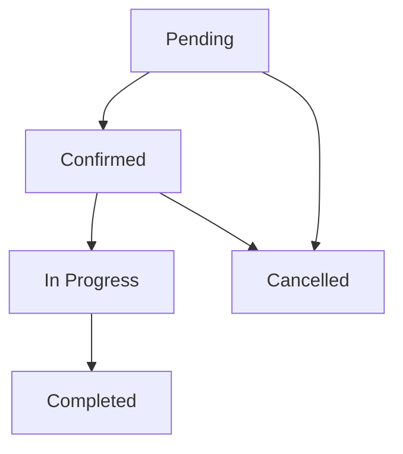

# Fresh Home: Backend Architecture Documentation (v2.0)

## 1. System Overview
Fresh Home is an enterprise-grade home services platform built on Supabase. The architecture emphasizes **data integrity**, **security**, and **scalability** by centralizing business logic within the database layer using PostgreSQL triggers and RPC functions.

## 2. Database Schema (Core Persistence)

### Identity & Profiles
- **`profiles`**: Unified user data. Implements **Soft Delete** via `deleted_at`.
- **`roles`**: Master table for system roles (`client`, `technician`, `admin`).
- **`user_roles`**: Pivot table (M:N) for strict role management. Single source of truth.

### Contact System
- **`user_phones`**: 1:N relationship with `profiles`. Managed via atomic RPC.
- **`user_addresses`**: 1:N relationship with `profiles`. Managed via atomic RPC.

### Technician Module
- **`technician_profiles`**: Extended profile for service providers, auto-provisioned upon role assignment.

### Booking System
- **`bookings`**: Core transaction table using **JSONB Snapshots** for service, address, and pricing data to ensure historical accuracy.
- **`booking_logs`**: Automated audit trail tracking status transitions and assignments.

## 3. Booking Lifecycle (State Machine)
The booking status is strictly enforced via the `trg_validate_booking_status` trigger.

**Valid Transitions:**
- `pending` → `confirmed` | `cancelled`
- `confirmed` → `in_progress` | `cancelled`
- `in_progress` → `completed`

## 4. Contact Management Design
To ensure **atomicity** and reduce network overhead, all phone and address updates are handled via the `sync_user_profile` RPC. This function runs in a single transaction, diffing the provided JSON arrays against existing data and performing all necessary CUD operations.

## 5. Security Model
- **Zero-Trust Role Assignment**: Roles are assigned only via secure backend logic or admin overrides. Identity metadata is never trusted.
- **Strict RLS**: Row Level Security is active on all tables. Users are isolated to their own records, while Admins have platform-wide visibility via the `is_admin()` SECURITY DEFINER function.
- **Soft Deletes**: Users are never hard-deleted. RLS policies automatically filter out soft-deleted records for standard queries.

## 6. Key Architectural Decisions
- **Logic in DB**: Triggers handle auditing and state enforcement to prevent "dirty data" from bypassing application-level checks.
- **JSONB Snapshots**: Using snapshots in `bookings` prevents billing or service discrepancies if the original service price or user address changes after the booking is made.
- **Composite Indexing**: Optimized for technician workload queries (`technician_id`, `status`).

## 7. Migration Notes (MVP → Enterprise)
- Removed `profiles.roles` array in favor of `user_roles` pivot.
- Replaced flattened address columns in `bookings` with JSONB snapshots.
- Automated technician profile creation.
- Introduced `booking_logs` automation.
