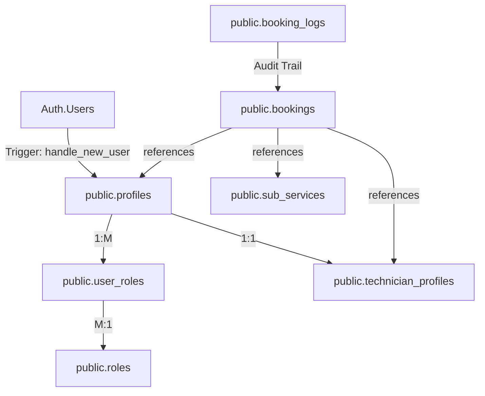

# Fresh Home: Full Architecture Audit Analysis
## Technician Capability & User Management (Phase 1)

### 1. Current Architecture Diagram (Logic Flow)

### 2. Tables Currently Used
| Table | Purpose | Key Columns |
| :--- | :--- | :--- |
| `profiles` | Unified user identity | `id`, `first_name`, `last_name`, `email`, `account_status` |
| `roles` | System role definitions | `id`, `name` (client, technician, admin) |
| `user_roles` | RBAC Pivot table | `user_id`, `role_id` |
| `technician_profiles` | Provider-specific data | `user_id`, `bio`, `rating`, `is_available`, `service_area` |
| `main_services` | High-level categories | `id`, `title` (JSONB), `description` (JSONB) |
| `sub_services` | Specific service items | `id`, `main_service_id`, `price_config` (JSONB) |
| `bookings` | Service transactions | `id`, `user_id`, `technician_id`, `service_id`, `address_snapshot` |
| `booking_logs` | State machine auditing | `id`, `booking_id`, `old_status`, `new_status`, `technician_id` |

### 3. Relationships Currently Implemented
- **Profiles ↔ Roles**: Many-to-Many via `user_roles`.
- **Profiles ↔ TechnicianProfile**: One-to-One (technician specific data).
- **Bookings ↔ Profiles**: Many-to-One (customer).
- **Bookings ↔ TechnicianProfile**: Many-to-One (assignee).
- **Bookings ↔ SubServices**: Many-to-One (purchased service).
- **Main Services ↔ SubServices**: One-to-Many.

### 4. Missing Enterprise Features (Capability Gaps)
- **Service-Technician Mapping**: No table exists to define which services a technician is capable of performing. Currently, there is No "Skills" or "Specialization" entity.
- **Service-Based Technician Filtering**: Since no mapping exists, the system cannot filter technicians by service capability at the DB level.
- **Technician Capacity**: There is no tracking of workload capacity (e.g., maximum bookings per day or per service type).
- **Workload Balancing**: No logic to auto-assign or suggest technicians based on current schedule/proximity.
- **Advanced Availability**: `is_available` is a simple boolean; no calendar-based availability or shift management exists.

### 5. Technical & Data Integrity Risks
> [!IMPORTANT]
> **Schema-Code Discrepancy (Critical)**
> The `BookingRemoteModel` in Flutter (shared package) is out of sync with the `bookings` table in `supabase_production_schema.sql`.
> - **Flutter Model:** Expects flattened fields like `address_governorate`, `booked_service_name`, etc.
> - **SQL Schema:** Uses JSONB fields (`address_snapshot`, `service_snapshot`, `price_snapshot`).
> - **Result:** Current production code will fail to write/read from the V2.0 Enterprise table structure.

- **Missing Technician Association in Flutter**: The `Booking` domain entity and `BookingRemoteModel` do not contain a `technician_id` or `technician` object. The assignment logic exists in SQL but is not bridge-connected to the Flutter UI/Domain.
- **Incomplete Stream Filtering**: `BookingRemoteDataSourceImpl.watchAllBookings` receives `serviceNames` but does not apply them to the Supabase stream, resulting in over-fetching.

### 6. Scalability Risks
- **JSONB Snapshots in Flutter**: Flutter's lack of formal models for these snapshots makes them hard to maintain and prone to "blind typing" (Map<String, dynamic>).
- **Client-Side Filtering**: Staff app filters orders by service name on the client side. This will degrade performance as the number of bookings grows.
- **Single Role Assumption**: While `user_roles` supports M:N, much of the app logic checks for a single role (e.g., `isTechnician`), which might break if a user has dual roles (e.g., Admin + Technician).

### 7. UI / Backend Limitations
- **Admin App**: Missing a dedicated "Technician Management" or "Booking Assignment" interface.
- **Staff App**: Lacks the ability for technicians to manage their "Managed Services" (since the DB doesn't support it yet).
- **Manual Assignment**: No automated or semi-automated assignment logic; everything must be manual (currently unsupported in UI).

### 8. Summary: MVP vs Enterprise Comparison
| Feature | MVP State (Current Flutter) | Enterprise State (Target) |
| :--- | :--- | :--- |
| **User Roles** | Simple RBAC | Granular Capabilities / Skills |
| **Bookings** | Flattened Data | JSONB Snapshots (Historical Accuracy) |
| **Assignments** | None / Manual DB-side | Rule-based Service Filtering |
| **Logic Location** | Mixed (App + DB) | Centralized DB Triggers / RPCs |
| **Security** | Basic RLS | High-Auditability Logs + Strict RLS |

### Conclusion
The **Database Layer** has been advanced to an Enterprise level (v2.0) with snapshots and audit logs, but the **Flutter Layer** remains in an MVP state, using an incompatible data model and lacking technician assignment capabilities. 

**Priority 1 Recommendation:** Synchronize the Flutter `Booking` models with the V2.0 JSONB snapshot schema and introduce the `technicianId` to the domain entity.
