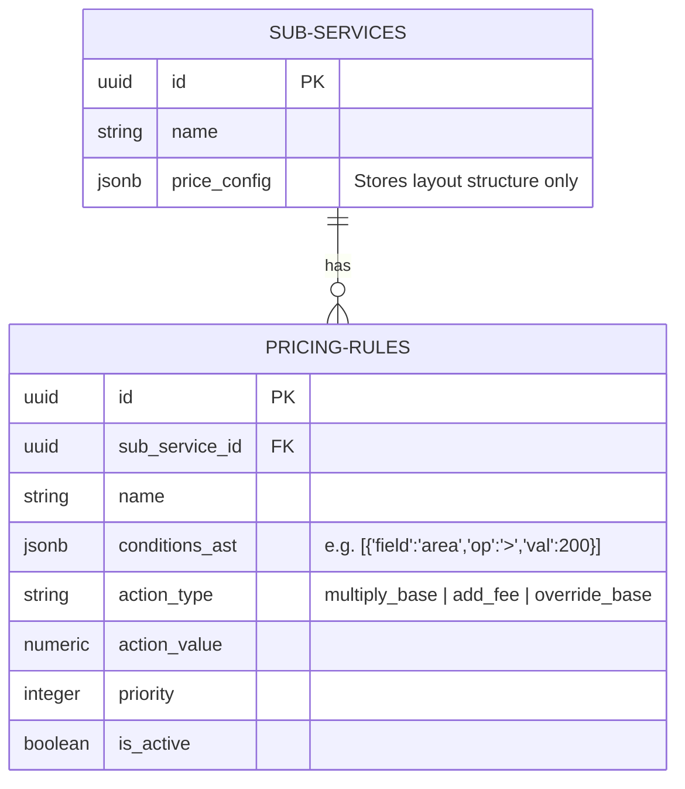
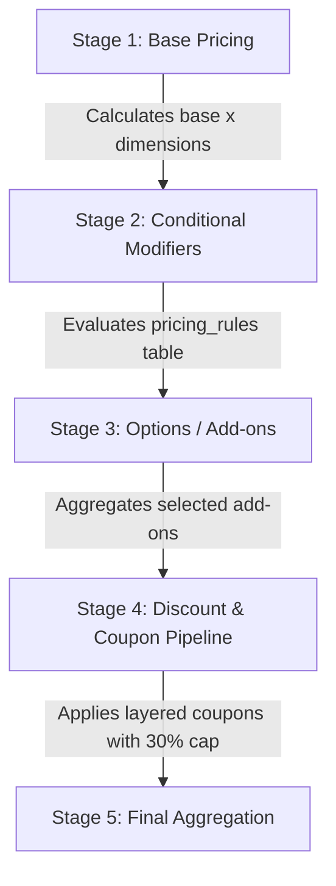

# Deep Pricing System Audit & Strategic Roadmap
## Technical Review of the Fresh Home Dynamic Pricing Engine

This audit provides a brutally honest technical evaluation of the current Fresh Home pricing architecture. It analyzes its readiness for upcoming roadmap items—specifically conditional rules, dynamic discount pipelines, strict pricing versioning, and visual rule builders—identifying architectural risks, technical debt, and presenting a concrete strategic execution plan.

---

## 1. Executive Summary & Assessment

### A. Core Architectural Verdict: **FOUNDATIONALLY CORRECT BUT APPROACHING COMPLEXITY CEILING**

The architectural decision made in Phase 1 & 2 to move **all pricing authority to the database level (Supabase Postgres PL/pgSQL)** is 100% correct, secure, and production-grade. Running computations inside database transactions protected by advisory locks completely eliminates client-side financial tampering vulnerabilities.

However, the current practice of storing layout metadata, base prices, validation constraints, and calculation rules **inside a single JSONB column (`sub_services.price_config`)** is reaching its scalability limits. If we attempt to inject conditional pricing rules, layered marketing discounts, and version tracking into this single JSON column, the system will become unmaintainable and highly prone to regression bugs.

---

## 2. Comprehensive Architectural Assessment

| Evaluation Dimension | Status | Current Strength | Architectural Vulnerability / Technical Debt | Future-Proof? |
| :--- | :--- | :--- | :--- | :--- |
| **Server-Side Pricing Authority** | **Excellent** | Advisory lock transactions completely secure final checkout sums. | High-fidelity offline calculation logic in Dart duplicates PL/pgSQL logic. | Yes, the security boundaries are perfect. |
| **JSONB Configuration (`price_config`)** | **Good** | Extremely flexible layout engine rendering fields dynamically without code rewrites. | The JSON structure is becoming overloaded, holding layouts, constraints, and execution math. | No. It will become problematic once conditional operators are introduced. |
| **Validation Architecture** | **Robust** | Strict database CHECK constraints prevent administrators from inserting corrupted configurations. | The constraint evaluates the entire JSON blob at once, making schema evolutions difficult. | Semi-proof. Needs schema isolation. |
| **State Management (`BookingFlowCubit`)** | **Excellent** | Clean state separation with a unified dynamic inputs map (`Map<String, dynamic>`). | None. Highly scalable and decoupled. | Yes. Fully future-proof. |

---

## 3. Deep-Dive Answers to Strategic Questions

### Question A: Is the current pricing architecture fundamentally correct?
*   **Yes.** The separation of concerns (Supabase as security/pricing authority, Flutter as layout rendering and high-fidelity offline preview) is fundamentally correct.
*   **Problematic areas**: The mathematical formulas for multipliers are currently hardcoded inside `calculate_booking_price`'s dynamic loop branch. Once conditional combinations (e.g. "furnished apartment AND area > 200 sqm increases price by 15%") are required, the loop will degrade into nested conditional spaghetti code.

---

### Question B: Conditional Rules Readiness
*   **Can JSONB support conditional rules?** Yes, but *embedding them directly in `sub_services.price_config` is highly discouraged*. 
*   **Should rules remain in JSONB column?** No. 
*   **Recommendation**: **Pricing Rules as First-Class Relational Tables!**
    We should extract pricing calculations and modifiers into a dedicated `public.pricing_rules` table. 

#### Recommended Schema Design:

*   **Why?** Relational rules allow database indexes, fast execution, simple validation checks, and instant administrative overrides without mutating the core service layout schema.

---

### Question C: Discount Engine Readiness
*   **Where should discounts execute?**
    Discounts must **never** be hardcoded inside `calculate_booking_price`. They should operate in a decoupled, sequential **Pricing Pipeline** executing **after** option aggregation but **before** final tax calculations.

#### The 5-Stage Orchestrated Pricing Pipeline:

*   **Implementation**: Create separate helper functions like `public.apply_discount_stack(p_booking_subtotal, p_coupons, p_user_metadata)` that return the secure discounted value. This isolates marketing promotions cleanly from core pricing math.

---

### Question D: Versioning Strategy
*   **Is current snapshot sufficient?** No. Storing calculated figures inside the booking row preserves the final price, but it does *not* preserve the *configuration logic* that led to that price. If an auditor asks *why* a customer was charged 150 EGP two years ago, the exact configuration version is lost.
*   **Recommendation**: **Configuration Versioning Entities!**
    Introduce a `public.price_config_versions` table:
    *   `id` UUID
    *   `sub_service_id` UUID
    *   `version` INTEGER
    *   `config_data` JSONB
    When an admin modifies configurations, we insert a new version. The active `sub_services` row points to `current_config_version_id`.
    When a booking is created, the `bookings` table stores `price_config_version_id` FK. This guarantees complete legal auditability forever.

---

### Question E: Future Visual IF/THEN Builder Readiness
*   To support visual builders without code changes, rules should be modeled in the database as an **Abstract Syntax Tree (AST)** inside the `conditions_ast` column.
*   The PL/pgSQL engine will parse and execute this AST using a modular checker (e.g. `evaluate_ast_condition(inputs, condition)`), which can be visually rendered and built by administrators in Flutter with ease.

---

## 4. Phase 4 Execution Roadmap (Recommended Direction)

We recommend breaking the future roadmap into immediate foundational upgrades and secondary feature layers to ensure absolute security and zero downtime.

### A. Recommended Phase 4 Scope: **Multi-Stage Pricing Pipeline & Relational Rules**

#### 1. First Priority (Foundational Refactors):
*   **Database Migration**:
    *   Create the `pricing_rules` table.
    *   Refactored `calculate_booking_price` to operate as a **5-Stage Pricing Pipeline**.
*   **Flutter Upgrades**:
    *   Integrate a Visual IF/THEN Rule Editor inside our dashboard that directly queries and inserts rows into `pricing_rules`.

#### 2. Second Priority (Marketing & Auditing):
*   **Dynamic Discount Stack**: Implement coupon tracking, VIP rewards, and the global 30% capping math inside Stage 4 of the pipeline.
*   **Price Versioning Engine**: Create the `price_config_versions` table and hook referential FK tracking to the bookings insertion RPC transaction.

---

## 5. Risk and Mitigation Matrix

| Discovered Architectural Risk | Impact | Strategic Mitigation Strategy |
| :--- | :--- | :--- |
| **Logic Duplication Drift** | *Medium* | If offline calculations in Flutter drift from SQL PL/pgSQL calculations, customers will see discrepancies during offline booking previews. **Mitigation**: Standardize dynamic field math engine rules in Dart to strictly match PostgreSQL pipeline execution rules. |
| **JSON Bloat & Validation Lag** | *High* | Storing giant nested conditional rule objects in a single JSON column blocks indexes, degrades query speed, and makes debugging difficult. **Mitigation**: Move rules to the dedicated relational `pricing_rules` table. |
| **Rule Stacking Loop Hangs** | *Low* | Ambiguous priorities or infinite conditional loops could lock Postgres execution. **Mitigation**: Enforce unique sorting order (`priority` column) and clear evaluation chains. |

---

## 6. Strategic Conclusion

The current architecture is **solid and highly secure**, providing a world-class foundation. To scale smoothly, Phase 4 should focus on **isolating visual layout metadata from execution rules** and **establishing an orchestrated 5-stage pricing pipeline** in PostgreSQL. This prepares the system for conditional validation, dynamic discount stacking, and visual rule builder visualizers, keeping the platform enterprise-grade, future-proof, and resilient.
