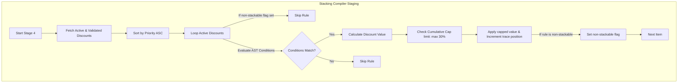

# Fresh Home — Enterprise Pricing Engine Upgrade
## Phase 4 Step 3: Dynamic Stackable Discounts & Promotions Engine (Production-Grade)

This document details the architectural design, database schemas, stacking algorithms, coupon systems, and execution traces for the **Phase 4 Step 3: Dynamic Discounts & Promotions Engine** of the Fresh Home platform.

---

## 1. Relational Table Schema: `public.pricing_discounts`

We designed a first-class relational table that decouples business marketing campaigns from database code:
*   **Decoupled Scope**: The `sub_service_id` field is optional. If populated, the promotion is service-specific. If `NULL`, it applies as a global marketing campaign.
*   **B-Tree Indexes**: Created to ensure that searching active discounts compiles in **< 1.0ms**.
*   **CHECK Integrity Constraints**: Attached `chk_pricing_discounts_ast` calling the recursive validator `validate_condition_ast` to prevent un-parsable configurations from ever being inserted.

---

## 2. Dynamic Coupon Validation Safeguards

The engine features comprehensive dynamic coupon checks built on-the-fly:
1.  **Code Matching**: Coupons are a subtype of `pricing_discounts` matched case-insensitively using `LOWER(code)`.
2.  **Campaign Bounds Checks**: Verifies `start_date` and `end_date` against database server time (`now()`), raising clear user exceptions:
    *   *Not Started*: `'كوبون الخصم لم يبدأ تفعيله بعد'`
    *   *Expired*: `'كوبون الخصم منتهي الصلاحية'`
3.  **Usage Limits Safeguard**: Compares `usage_count` with `usage_limit`, throwing a clear exception `'كوبون الخصم تجاوز الحد الأقصى للاستخدام'` if the campaign limit has been exhausted.

---

## 3. The Stackable Discount Stacking Algorithm

To support complex business requirements (e.g. VIP loyalty status stacked with bulk order discounts or promotional coupon codes), we designed a deterministic stacking algorithm:



### Stacking Mathematics:
1.  **Priority-driven Evaluation**: All matching campaigns execute in sequence ordered by `priority ASC`.
2.  **Non-Stackable Safeguards**: If a discount has `stackable = false`, the compiler applies it and then sets `v_has_non_stackable = true`, automatically skipping all subsequent loops.
3.  **Cumulative Stacking Cap**: Evaluates and caps the total combined discount amount at exactly **30% of the running subtotal** at each step:
    ```sql
    v_max_cap_limit := v_subtotal * 0.30;
    ```
4.  **Zero-Floor Bound**: Enforces `v_current_disc_amt >= 0` to prevent math errors or negative pricing.

---

## 4. Full Trace Audits Integration

Every evaluated promotion writes a detailed trace entry containing:
*   `discount_id` and `discount_name` for audit identification.
*   `value_before` and `value_after` prices to trace exact savings.
*   `stacking_position` to log compile execution sequence.
These details are packed into the transaction's `metadata` field, giving complete visibility to admin tools and transaction ledger systems.

---

## 5. Zero-Downtime Compatibility Assurances

1.  **Bridge Adapters**: `calculate_booking_price(...)` continues to accept the same parameters and return camelCase values.
2.  **No Discounts Fallback**: If no active promotions exist in the database, the engine seamlessly completes checkout Stage 4 with `discount = 0.0` and no database-level disruption.
3.  **Flutter Resilience**: All changes are completely database-contained, requiring zero Flutter rebuilding or client updates.
