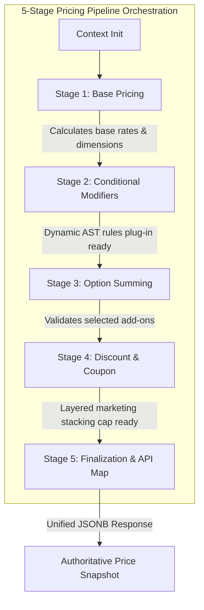

# Fresh Home — Enterprise Pricing Pipeline Upgrade
## Phase 4 Step 1: Multi-Stage Server-Side Pricing Pipeline & Context Refactor

This document details the architectural decisions, design improvements, execution pipeline, and strategic planning behind the **Phase 4 Step 1: Pricing Pipeline Refactor** for the Fresh Home platform.

---

## 1. What was the Legacy Status?

Previously, the dynamic pricing engine inside Supabase (`calculate_booking_price` in version 1.0) was a monolithic PL/pgSQL function. It received the `sub_service_id` and raw inputs, fetched the configuration, and then ran:
*   Nested conditional branches to calculate basic dimension math (e.g. area multipliers, linear perimeter calculations).
*   Dynamic loop aggregations to parse dynamic layouts and add modifiers.
*   Manual options validation and incremental addition loops.
*   Final sum calculations (`total = base_price + extra_fees - discount`).

---

## 2. What were the Architectural Problems in the Legacy Status?

1.  **Tight Logic Coupling**: Core calculations, dynamic layouts, layout validation, option sum constraints, and final output maps were all bound in a single execution block.
2.  **Violated Single Responsibility Principle (SRP)**: Any change in how extra options were validated required rewriting code right next to the core dimension math.
3.  **Spaghetti Conditional Traps**: Attempting to inject new business logic (e.g. Furnished modifiers, Coupon limits, VIP discounts) would turn the monolithic loops into hard-to-maintain nested conditionals.
4.  **No Context Sharing**: Variables were passed as loose, unindexed local PL/pgSQL stack variables, blocking parallel state additions or modular tracing.
5.  **Signature Conflicts**: Altering input parameters risked breaking existing bookings schemas or frontend mapping APIs, resulting in database lockouts.

---

## 3. What was Improved in this Refactor?

1.  **Orchestrated Multi-Stage Execution**: We broke the monolithic calculation into 5 completely isolated, decoupled helper functions (Stages 1 to 5).
2.  **Unified JSONB Pricing Context (`v_context`)**: We introduced a structured JSON state context passed sequentially.
    ```json
    {
      "base_price": 0.0,
      "subtotal": 0.0,
      "extra_fees": 0.0,
      "discount": 0.0,
      "pricing_inputs": {},
      "selected_options": [],
      "options_breakdown": []
    }
    ```
    This context isolates state mutations, allowing stages to augment parameters safely.
3.  **Strict Signature Drops**: We added explicit signature drops (`DROP FUNCTION IF EXISTS`) in our migration script to completely clean the database state before initialization, eliminating PostgreSQL overloaded parameter errors.
4.  **Plug-in Readiness**: Prepared Stage 2 (Conditional Modifiers) and Stage 4 (Discounts) as fully modular plug-in blocks ready to load relational schemas from future tables without altering Stage 1 or Stage 3.
5.  **Absolute Zero-Downtime API Preservation**: The final JSON structure mapped from Stage 5 maintains camelCase API parameters (`basePrice`, `extraFees`, `discount`, `total`) exactly. This guarantees that **100% of existing Flutter apps, downstream views, and transactional booking APIs continue to function perfectly**.

---

## 4. How the 5-Stage Pricing Pipeline Works



### Execution Details:
*   **Stage 1: Base Pricing (`stage_1_calculate_base_pricing`)**: Parses dynamic dynamic layouts or classic fallbacks, computes base prices from units and dimensions, and returns base cost updates.
*   **Stage 2: Conditional Rules (`stage_2_apply_conditional_rules`)**: Plug-in point to evaluate visual IF/THEN rules, modifying running `subtotal` parameters.
*   **Stage 3: Option Summing (`stage_3_apply_options`)**: Validates option keys and aggregates pricing option values securely.
*   **Stage 4: Marketing Discounts (`stage_4_apply_discounts`)**: Processes coupon codes and stackable loyalty discounts.
*   **Stage 5: Finalization (`stage_5_finalize_pricing`)**: Applies final formulas (`total = subtotal + extra_fees - discount`) and returns the secure API payload.

---

## 5. Extensibility: Prepared for Future Features

*   **Conditional Rules (Stage 2)**: Plug-in ready. Future updates will simply load relational modifiers from `public.pricing_rules` table and parse the AST condition JSON logic.
*   **Layered Discounts (Stage 4)**: Plug-in ready. Ready to pull promo schemas, verify VIP rewards, and cap combinations at a global 30% threshold.
*   **Configuration Versioning**: Fully compatible. Because the orchestrator (`calculate_booking_price`) separates config loading from pipeline execution, we can easily change Stage 1 to fetch from versioned schema tables in the future.
*   **Dashboard Visual Builders**: Fully compatible. The system decouples layout schemas from logic. This means admins can configure visual fields on the admin screen, and the pipeline will execute it without any database adjustments.

---

## 6. Risks & Strategic Mitigations

| Risk | Impact | Mitigation Strategy |
| :--- | :--- | :--- |
| **Logic Duplication Drift** | *Medium* | Flutter high-fidelity offline preview logic must mirror SQL PL/pgSQL formulas. **Mitigation**: Update Flutter `CalculatePriceUseCase` to mirror Stage 1 base calculations exactly. |
| **Database Migration Signature Clash** | *Low* | Legacy overloaded function signatures on Postgres could clash during runtime execution. **Mitigation**: Added proactive drop constraints for all pricing helper functions before creation. |

---

## 7. Recommended Next Step: **Phase 4 Step 2: Relational Conditional Rules Database Schema**

The best next step is to **create the `public.pricing_rules` table** and implement the relational AST parser inside Stage 2. This represents a solid, fully operational Phase 4 milestone, establishing the platform's advanced pricing engine.
