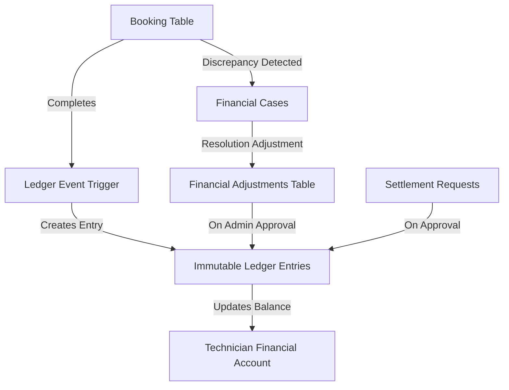
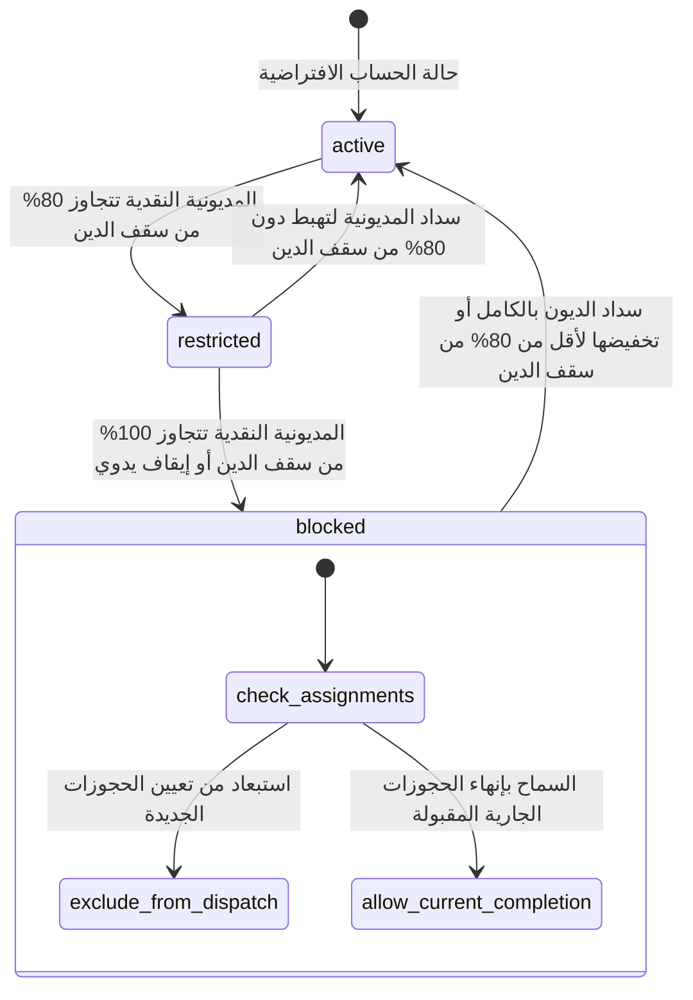
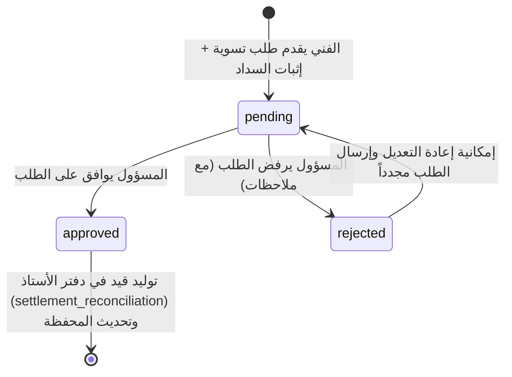
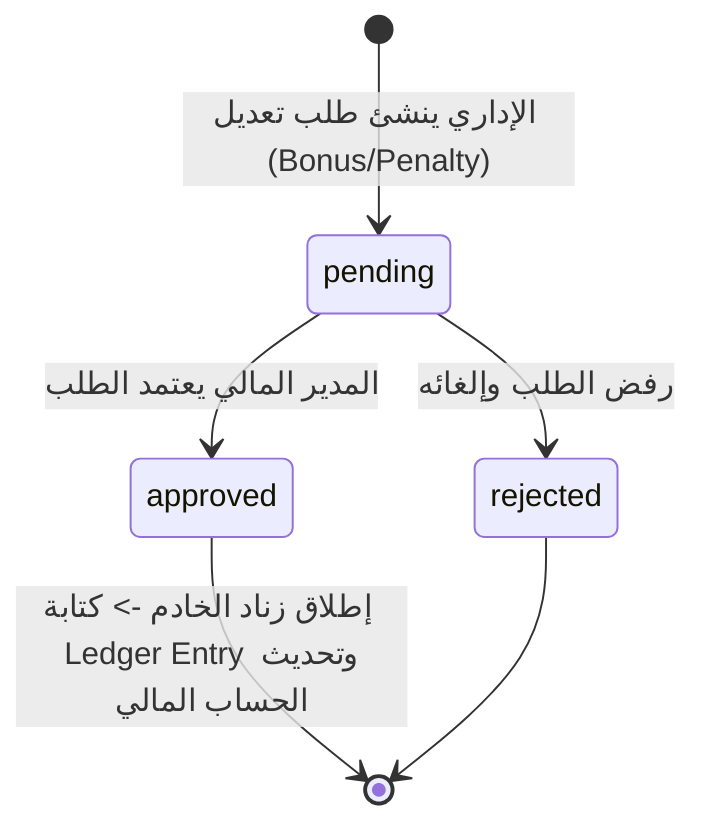

# المواصفات الفنية والهندسة المالية للنظام (Financial Architecture Specification)

## سجل المراجعة والتعديلات (Revision History)

| الإصدار (Version) | التاريخ (Date) | التفاصيل (Details) | الحالة (Status) |
| :--- | :--- | :--- | :--- |
| `v1.0 - Initial` | 2026-06-10 | التصميم المالي المبدئي لنظام حسابات الفنيين ودفتر الأستاذ والتسويات. | مؤرشف |
| `v1.1 - Revision v1` | 2026-06-10 | مراجعة هيكل الأرصدة (إلغاء تخزين الرصيد الإجمالي)، وإضافة كيان `financial_adjustments` المستقل، وحالات الحساب المالي للفني `account_status` ومساراتها، وتوثيق رؤية كشف الحساب للفني. | **معتمد ونشط** |

---

## 1. الهيكل العام للنظام المالي (High-Level Financial Architecture)

تم تصميم النظام المالي ليكون **نظام قيد مزدوج آمن (Double-Entry Ledger System)** يعتمد بالكامل على قاعدة البيانات ليكون هو مصدر الحقيقة المطلقة للعمليات المالية. يتم عزل منطق الواجهة الرسومية تماماً عن العمليات الحسابية، وتخضع جميع الجداول لسياسات أمان صارمة (RLS).

### المكونات الرئيسية للنظام:
1.  **حساب الفني المالي (`TechnicianFinancialAccount`):** يمثل السجل المالي للفني والذي يتضمن الديون، والمستحقات، وسقف الدين الأقصى المسموح به، وحالة الحساب المالي للفني.
2.  **التعديلات الإدارية (`FinancialAdjustment`):** كيان مخصص للتحكم في الحوافز، والجزاءات، والتسويات اليدوية مع إمكانية إرفاق مستندات المراجعة واعتمادها من المسؤول المالي قبل توليد قيود دفتر الأستاذ.
3.  **دفتر الأستاذ غير القابل للتعديل (`LedgerEntry`):** سجل تاريخي متسلسل لجميع الحركات المالية الصادرة والواردة.
4.  **تسويات الحسابات (`SettlementRequest`):** دورة تقديم طلبات سداد المديونيات أو استلام المستحقات للفنيين واعتمادها من الإداريين.
5.  **إدارة القضايا والخلافات (`FinancialCase`):** نظام مستقل لتسجيل المشاكل المالية (مثل فروق التحصيل النقدي) وحلها دون تعطيل دورة حياة الطلبات الأساسية.



---

## 2. تعريف الكيانات البرمجية (Entity Definitions)

### أ. حساب الفني المالي (`TechnicianFinancialAccount`)
يمثل الكيان الحاضن للرصيد المالي للفني وحالة حسابه المالية وسقف الدين.
*   **المعرف الرئيسي (`id`):** UUID.
*   **الفني (`technician_id`):** مرجع للملف الشخصي للفني (`profiles.id`).
*   **صافي الرصيد الجاري (`net_balance`):** **[معدل في Revision v1]** قيمة احتسابية ديناميكية تحتسب جبرياً بالمعادلة: `amount_owed_to_technician - amount_owed_to_company` (لا تخزن كعمود فيزيائي بقاعدة البيانات لتجنب تكرار مصادر الحقيقة).
*   **المبالغ المستحقة للشركة (`amount_owed_to_company`):** مجموع الكاش المحصل من الفني والذي يتجاوز صافي أرباحه (الدين الفعلي المستحق للشركة).
*   **المبالغ المستحقة للفني (`amount_owed_to_technician`):** الأرباح المتراكمة للفني من عمليات الدفع الإلكتروني التي حصلتها الشركة وتستحق التحويل للفني.
*   **سقف الدين المسموح (`debt_limit`):** الحد الأقصى للمديونية النقدية المسموح بها للفني قبل حظره تلقائياً من تلقي حجوزات جديدة.
*   **حالة الحساب المالي للفني (`account_status`):** **[جديد في Revision v1]** تحدد الأهلية التشغيلية والمالية للفني وتتضمن ثلاث حالات: `active`, `restricted`, `blocked`.

### ب. التعديلات المالية الإدارية (`FinancialAdjustment`) **[جديد في Revision v1]**
كيان مستقل ومسؤول عن توثيق ومراجعة الحوافز والخصومات التي يدخلها المسؤولون قبل إدراجها في كشف الحساب المالي الفعلي.
*   **نوع التعديل (`adjustment_type`):** يحدد تصنيف التعديل:
    *   `bonus`: حافز مالي إضافي للفني.
    *   `penalty`: عقوبة/خصم مالي يطبق على الفني.
    *   `adjustment`: تسوية يدوية إدارية عامة لتصحيح الأرصدة.
*   **القيمة المادية (`amount`):** القيمة الإجمالية للتعديل.
*   **حالة التعديل (`status`):** `pending` (قيد المراجعة والاعتماد)، `approved` (تم الاعتماد وتوليد القيد المحاسبي)، `rejected` (تم الرفض والإلغاء).
*   **مستند الإثبات (`attachment_url`):** رابط اختياري لملف أو صورة إثبات (فاتورة، لقطة شاشة، مستند تفويضي) مخزن بـ Supabase Storage.
*   **بيانات المسؤول والاعتماد:** توثيق المستخدم المنشئ والمسؤول المعتمد وتواريخ التعديل والاعتماد.

### ج. قيد دفتر الأستاذ (`LedgerEntry`)
يمثل الحركة المالية الفردية. هذه الجداول لا تدعم عمليات التحديث أو الحذف نهائياً (Immutable).
*   **نوع الحركة (`entry_type`):** يحدد طبيعة المعاملة:
    *   `order_earnings`: أرباح الفني من الطلبات.
    *   `company_commission_debit`: عمولة الشركة المستقطعة.
    *   `cash_collection_debit`: تسجيل سداد كاش تم تحصيله.
    *   `manual_bonus`: حافز مالي تم اعتماده وتطبيقه.
    *   `manual_penalty`: عقوبة مالية تم اعتمادها وتطبيقها.
    *   `manual_adjustment`: تسوية يدوية عامة تم اعتمادها.
    *   `settlement_reconciliation`: تسوية قيود المديونية/المستحقات عند مراجعة طلب التسوية.
*   **المدين والدائن (`debit` / `credit`):** قيم مالية موجبة تسجل اتجاه الحركة المالية.
*   **الرصيد الجاري بعد القيد (`running_balance`):** الرصيد الإجمالي التراكمي للفني بعد تطبيق هذه المعاملة مباشرة لمنع تضارب الترتيب التاريخي.

### د. طلب التسوية (`SettlementRequest`)
طلب يقدمه الفني لإجراء تسوية مالية للمديونيات أو المطالبة بأرباحه المتراكمة.
*   **طريقة التسوية (`method`):** `vodafone_cash`, `instapay`, `bank_transfer`, `cash_handover`, `other`.
*   **إثبات السداد (`proof_image_url`):** رابط مستند أو لقطة شاشة لإثبات التحويل المالي.
*   **حالة الطلب (`status`):** `pending`, `approved` (معتمد ويحدث المحفظة)، `rejected`.

### هـ. القضية المالية (`FinancialCase`)
تسجيل النزاعات المالية والفروقات دون تعطيل إإتمام الحجز.
*   **نوع الخلاف (`discrepancy_type`):** `refused_full_payment`, `partial_completion`, `admin_approved_discount`, `pricing_dispute`, `collection_discrepancy`.
*   **حالة القضية (`status`):** `pending_review`, `in_investigation`, `resolved`, `dismissed`.

---

## 3. العلاقات وهيكل الكيانات (Entity Relationships)

```erDiagram
    PROFILES ||--|| TECHNICIAN_PROFILES : "references"
    PROFILES ||--o| TECHNICIAN_FINANCIAL_ACCOUNT : "has financial account"
    TECHNICIAN_FINANCIAL_ACCOUNT ||--o{ LEDGER_ENTRY : "contains ledger entries"
    BOOKINGS ||--o{ LEDGER_ENTRY : "triggers ledger entries"
    BOOKINGS ||--o| FINANCIAL_CASE : "may generate financial case"
    PROFILES ||--o{ SETTLEMENT_REQUEST : "submits settlement request"
    FINANCIAL_CASE ||--o{ FINANCIAL_CASE_EVENT : "has audit trail events"
    PROFILES ||--o{ FINANCIAL_CASE_EVENT : "actors update events"
    PROFILES ||--o{ FINANCIAL_ADJUSTMENT : "creates/approves adjustments"
    FINANCIAL_ADJUSTMENT ||--o| LEDGER_ENTRY : "generates on approval"
```

---

## 4. دورات الحياة وانتقال الحالات (Lifecycle & State Transitions)

### أ. دورة حياة حالة حساب الفني المالي (`account_status`) **[جديد في Revision v1]**

تتم إدارة حالة الحساب المالي للفني بشكل آلي تماماً عبر قاعدة البيانات بالاعتماد على مقارنة مستويات الدين بسقف الدين:



*   **قواعد الإسناد والتشغيل:**
    *   **الحالة النشطة (`active`):** إسناد الحجوزات يعمل بشكل طبيعي بالكامل.
    *   **الحالة المقيدة تحذيرياً (`restricted`):** يظهر تحذير للمشرفين وللفني في التطبيق بضرورة السداد، ولا تتوقف عمليات إسناد الحجوزات.
    *   **الحالة الموقوفة مؤقتاً (`blocked`):** يتم فوراً استبعاد معرف الفني من نتائج دالة `get_available_technicians`. يمنع إسناد أي حجز للفني أوتوماتيكياً أو يدوياً من لوحة الإدارة. ويتاح للفني فقط الاطلاع وإنهاء الحجوزات الحالية التي تقع في الحالات (`accepted`, `on_the_way`, `arrived`, `in_progress`).

### ب. دورة حياة طلب التسوية المالي (`SettlementRequest`)


### ج. دورة حياة التعديل المالي الإداري (`FinancialAdjustment`) **[جديد في Revision v1]**


---

## 5. رؤية كشف الحساب الخاص بالفني (Technician Financial Statement Vision) **[جديد في Revision v1]**

يهدف هذا التصميم المعماري إلى إظهار كشوف الحسابات وتفاصيل العمليات المالية للفنيين بشفافية ودقة، **دون الكشف عن نسب عمولة المنصة أو المعادلات الداخلية**.

### أ. الملخص المالي للفني (Financial Summary)
يعرض للفني ملخصاً تراكمياً بسيطاً لحسابه الجاري:
*   **المبالغ المستحقة للشركة (Amount Owed To Company):** مديونية الفني التراكمية الناتجة عن عمليات الكاش.
*   **المبالغ المستحقة للفني (Amount Owed To Technician):** مستحقات الفني الناتجة عن عمليات الدفع الإلكتروني.
*   **سقف الدين (Debt Limit):** الحد الأقصى للمديونية المسموح بها.
*   **السقف المتاح للتشغيل (Remaining Available Limit):** ويحتسب ديناميكياً: `debt_limit - amount_owed_to_company`.

### ب. المخطط الزمني للمعاملات (Transactions Timeline)
جدول زمني متسلسل لجميع الحركات المالية المقيدة في دفتر الأستاذ والتابعة للفني:
*   **تسوية طلب (Order Settlement):** صافي أرباح الفني أو مديونية العمولة المترتبة على الطلب (تظهر بقيمتها المحددة فقط).
*   **تحصيل نقدية (Cash Collection):** تسوية مديونية كاش تم سدادها للشركة واعتمادها.
*   **طلب تسوية حساب (Settlement Request):** إما سحب رصيد (صادر من الشركة) أو إيداع وسداد مديونية (وارد للشركة).
*   **الحوافز والخصومات الإدارية (Bonus / Penalty):** تفاصيل الحوافز المالية أو الجزاءات المعتمدة وسببها.

### ج. تفاصيل المعاملة (Drill Down Details)
عند قيام الفني بالضغط على أي معاملة في المخطط الزمني، يظهر له تفصيل السجل كالتالي:
*   **معاملة طلب (Order):** يعرض الرقم المرجعي للحجز، اسم الخدمة (التنظيف، الصيانة)، القيمة الإجمالية المدفوعة من العميل، وصافي مستحقات الفني من هذا الطلب، **دون عرض عمولة المنصة كنسبة مئوية أو تفصيل استقطاعها.**
*   **معاملة تسوية (Settlement):** يعرض تاريخ العملية، وسيلة الدفع (فودافون كاش، إنستاباي)، الملاحظات، وحالة الطلب.
*   **تعديل إداري (Adjustment):** يعرض القيمة، تاريخ الاعتماد، والسبب العام المدون من الإدارة (مثل: "حافز إتمام 10 طلبات هذا الأسبوع" أو "عقوبة تأخر عن موعد العميل").
