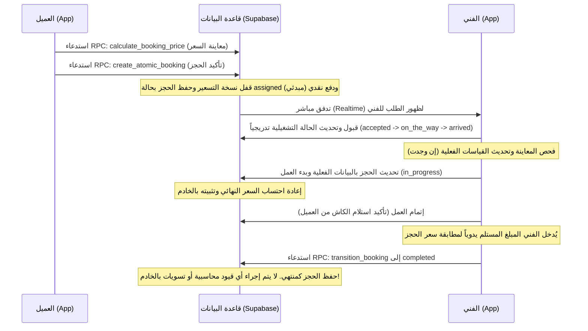

# تقرير التدقيق المالي وهيكلية النظام (Fresh Home Financial System Audit)

هذا التقرير يقدم تدقيقاً شاملاً للوضع الحالي لجميع مسارات العمل المالي، وتدقيق الجداول في قاعدة البيانات، ومحرك التسعير، وتطبيقات العميل، والفني، والمدير في منصة **Fresh Home**.

---

## 1. الملخص التنفيذي (Executive Summary)

يمتلك نظام **Fresh Home** بنية تحتية برمجية متماسكة وقوية في طبقة قاعدة البيانات (Supabase/PostgreSQL) تدعم دورة حياة الحجوزات وإدارة القدرة الاستيعابية للفنيين، مع محرك تسعير متطور يعمل بالكامل على خادم قاعدة البيانات عبر 5 مراحل معقدة لضمان توافق الحسابات ومنع التلاعب بها من جهة المستخدم.

ومع ذلك، **فإن النظام المالي الحالي يفتقر بالكامل إلى طبقة المحاسبة والتسويات الحقيقية في قاعدة البيانات**. رصيد الفني المعروض في التطبيق وسجل معاملاته يتم احتسابهما **ديناميكياً بالكامل داخل كود تطبيق الفني (Flutter Presentation Layer)** بناءً على الحجوزات المكتملة المخزنة في قاعدة البيانات، مع دمج معاملات وهمية (Mocked Transactions) لتوضيح الواجهة. لا توجد جداول للمحافظ (Wallets)، ولا توجد دفاتر أستاذ (Ledgers)، ولا توجد آليات تسوية معتمدة ومعززة بقواعد الأمان وقواعد التحكم في الوصول (RLS). 

بالتالي، فإن النظام جاهز تشغيلياً على مستوى مسارات الحجز والأسعار ولكنه في مرحلة الصفر تقريباً من الناحية المحاسبية والأرشفة المالية المستقلة.

---

## 2. الهندسة المالية الحالية (Existing Financial Architecture)

تتوزع العمليات المالية الحالية بين خادم قاعدة البيانات (Supabase) والواجهات البرمجية للتطبيقات كالتالي:

*   **محرك التسعير الآمن (Secure Server-Side Pricing Engine):**
    يتم احتساب قيم الخدمات بشكل قطعي على مستوى قاعدة البيانات لضمان عدم التلاعب بها. يمر الاحتساب بخمس مراحل متتالية في الدالة `execute_pricing_pipeline`:
    1.  **المرحلة 1 (Base Pricing):** حساب السعر الأساسي بناءً على الأبعاد أو الأطوال أو الأسعار الثابتة المدخلة.
    2.  **المرحلة 2 (Conditional Modifiers):** تطبيق قواعد التسعير المعقدة المخزنة كشجرة AST في جدول `pricing_rules`.
    3.  **المرحلة 3 (Options/Add-ons):** إضافة أسعار الخيارات والميزات الإضافية المحددة للخدمة.
    4.  **المرحلة 4 (Discounts & Coupons):** تطبيق الخصومات وحملات الكوبونات مع فرض سقف تراكمي أقصى قدره 30% من قيمة الخدمة.
    5.  **المرحلة 5 (Finalization):** مقارنة السعر بالحد الأدنى للخدمة، واحتساب عمولة المنصة وأرباح الفني كجزء من البيانات الوصفية (Metadata) للمجموع النهائي.
*   **سجل التدقيق المقفل (Pricing Versioning & Replay Engine):**
    أثناء إنشاء الحجز عبر `create_atomic_booking` يتم قفل نسخة التسعير النشطة لتلك الخدمة في جدول `pricing_versions` وربط الحجز برقم النسخة `pricing_version_id`. يتيح ذلك إعادة محاكاة واحتساب سعر الحجز التاريخي عبر الدالة `replay_booking_pricing` للتحقق من عدم حدوث تلاعب في الأسعار (Immutable Ledger Audit).
*   **معالجة الحجز المالي في التطبيقات:**
    *   **تطبيق العميل:** يظهر للعميل فاتورة تفصيلية مبنية على السعر الإجمالي المحتسب بالخادم ولا يتيح سوى طريقة دفع واحدة مشفرة برمجياً وهي الكاش (`confirmation_payment_cash`).
    *   **تطبيق الفني:** يقوم الفني بتأكيد تحصيل المبلغ نقداً عند إتمام الطلب، ويقوم التطبيق بتحديث الحقل `pricing_inputs` بقيمة المبلغ المحصل وطريقة الدفع قبل الانتقال للحالة `completed`.

---

## 3. تدقيق بنية قاعدة البيانات (Database Audit)

تم استكشاف قاعدة البيانات والبحث عن الكيانات والجداول والدوال والزنادات (Triggers) المرتبطة بالمالية والعمولات والتسويات، وتم التوصل إلى البنية التشغيلية التالية:

### أ. جداول النظام المالي الحالية (Active Tables)

#### 1. جدول الحجوزات `public.bookings`
*   **الغرض:** تخزين الحجوزات وتفاصيلها ودورة حياتها التشغيلية والمالية.
*   **الحقول المالية ذات الصلة:**
    *   `price_snapshot (JSONB)`: يخزن القيمة التفصيلية للأسعار (السعر الأساسي، الرسوم الإضافية، الخصومات، المجموع النهائي) مع البيانات الوصفية الخاصة بالعمولات وأرباح الفني.
    *   `pricing_inputs (JSONB)`: يخزن مدخلات العميل أثناء الحجز وتحديثات الفني مثل طريقة الدفع الفعلية (`payment_method`) والمبلغ المحصل (`collected_amount`).
    *   `payment_method (TEXT)`: حقل نصي مخصص لتحديد طريقة الدفع (غير مستغل برمجياً حالياً في الإدخال المباشر للـ RPC).
    *   `payment_status (TEXT)`: حالة الدفع الافتراضية `'pending'`.
    *   `pricing_version_id (UUID)`: مرجع لنسخة تسعير الخدمة المقفلة تاريخياً.
*   **الكيانات المرتبطة:** `profiles` (العميل والفني)، `services` (الخدمة المطلوبة).

#### 2. جدول الخدمات الموحد `public.services`
*   **الغرض:** يمثل شجرة الفئات والخدمات القابلة للحجز.
*   **الحقول المالية ذات الصلة:**
    *   `price_config (JSONB)`: يحتوي على إعدادات التسعير والحد الأدنى للخدمة.
    *   `commission_rate (NUMERIC)`: نسبة استقطاع المنصة (العمولة) من سعر الخدمة (افتراضياً 0.20 أي 20%). تم إضافته في الهجرة رقم 58.
*   **الكيانات المرتبطة:** ارتباط ذاتي حركي (`parent_id`) لبناء شجرة التصنيفات.

#### 3. جدول قواعد التسعير `public.pricing_rules`
*   **الغرض:** تخزين القواعد والزيادات الشرطية والديناميكية بناءً على شجرة AST.
*   **الحقول المالية ذات الصلة:** `action_type`, `action_value`, `action_target`.
*   **الكيانات المرتبطة:** جدول `services`.

#### 4. جدول الخصومات والكوبونات `public.pricing_discounts`
*   **الغرض:** تخزين حملات الكوبونات والخصومات التراكمية وحدود الاستخدام.
*   **الحقول المالية ذات الصلة:** `type` (نوع الخصم)، `value_type` (نسبة مئوية أو رقم ثابت)، `value` (القيمة)، `usage_limit`, `usage_count`.
*   **الكيانات المرتبطة:** جدول `services`.

#### 5. جدول نسخ التسعير المؤرشفة `public.pricing_versions`
*   **الغرض:** تجميد لقطة شاملة (Snapshot) للأسعار والقواعد والخصومات المرتبطة بخدمة معينة في لحظة معينة لضمان عدم تغير الحسابات التاريخية.
*   **الحقول المالية ذات الصلة:** `snapshot (JSONB)` (يحتوي على لقطة كاملة لـ `price_config` والقواعد والخصومات النشطة).
*   **الكيانات المرتبطة:** جدول `services`.

#### 6. جدول تدقيق وإدارة الأسعار `public.pricing_governance_audit`
*   **الغرض:** تسجيل عمليات المدير من تعديل أو حذف لقواعد التسعير وحملات الخصومات وعمليات المحاكاة التجريبية.
*   **الكيانات المرتبطة:** `pricing_rules`, `pricing_discounts`, `profiles`.

---

### ب. الدوال والإجراءات المخزنة (PostgreSQL Functions / RPCs)

1.  **`public.execute_pricing_pipeline(p_sub_service_id UUID, p_price_config JSONB, p_pricing_inputs JSONB) -> JSONB`**
    *   **الغرض:** المنظم الرئيسي الذي يقوم باستدعاء مراحل محرك التسعير الخمسة بشكل قطعي وإرجاع عقد حسابات التسعير النهائي.
2.  **`public.stage_5_finalize_pricing(p_sub_service_id TEXT, p_context JSONB) -> JSONB`**
    *   **الغرض:** إنهاء الحسابات واحتساب عمولة المنصة وأرباح الفني بناءً على نسبة العمولة المسجلة في الخدمة، وتضمينها في البيانات الوصفية للمجموع النهائي.
3.  **`public.create_atomic_booking(...) -> UUID`**
    *   **الغرض:** بوابة حجز موثوقة تقوم بحساب السعر الإجمالي وقفل نسخة التسعير وإنشاء سجل الحجز وتغيير حالته إلى `assigned` في معاملة ذرية واحدة (Atomic Transaction).
4.  **`public.replay_booking_pricing(p_booking_id UUID) -> JSONB`**
    *   **الغرض:** محرك التحقق من كشف الحساب والأسعار التاريخية عبر استعادة نسخة التسعير المقفلة وإعادة تسيير خط الأنابيب ومقارنة النتيجة بلقطة السعر المخزنة بالحجز.
5.  **`public.transition_booking(...) -> public.bookings`**
    *   **الغرض:** محرك دورة حياة الحجز والتحقق من الانتقالات المسموحة وتسجيل أحداث التغيير في جدول الأحداث.

---

### ج. الزنادات الحالية (Database Triggers)

*   **`trg_audit_pricing_rules`** و **`trg_audit_pricing_discounts`**: زنادات آلية على جداول القواعد والخصومات لتسجيل التغييرات في جدول `pricing_governance_audit`.
*   **`trg_generate_booking_id`**: لتوليد المعرف المقروء للحجز تلقائياً (مثل FH-100001).

---

## 4. مسارات التدفق المالي الحالية (Existing Financial Flows)

### أ. دورة حياة الحجز المالية (Booking Financial Lifecycle)

### ب. تدفق مستحقات الفني وعمولات الشركة
حالياً، لا توجد عملية مالية واحدة مسجلة في قاعدة البيانات للفنيين عند انتهاء الحجوزات.
*   **التحصيل النقدي (Cash Collection):** عندما يحصل الفني على كاش من العميل، يتم كتابة قيمة التحصيل داخل حقل البيانات الوصفية للحجز `pricing_inputs -> collected_amount`. 
*   **احتساب رصيد الفني (Technician Balance Calculation):** يتم فقط على واجهة التطبيق عبر الـ `FinancialCubit` بالطريقة التالية:
    1.  يتم تجميع كافة الحجوزات المكتملة (`status = 'completed'`) الخاصة بالفني.
    2.  لكل حجز، يتم قراءة السعر الإجمالي، واستخلاص عمولة الشركة (مثال: 30% أو 20%)، وصافي مستحقات الفني (مثال: 70% أو 80%) من البيانات الوصفية لـ `price_snapshot`.
    3.  إذا كان الحجز نقداً (كاش) وهو الافتراضي، يتم تسجيل مديونية على الفني بمقدار عمولة الشركة المستقطعة (قيمة سالبة: `-commission`).
    4.  إذا كان الدفع إلكترونياً (مستقبلاً)، يتم تسجيل رصيد مستحق للفني بمقدار صافي أرباحه (قيمة موجبة: `+techPayout`).
    5.  يتم دمج معاملتين وهميتين مشفرتين داخل كود دارت (Mock Transactions):
        *   `tx-mock-1`: تحويل من الفني للشركة بقيمة `+500 ج.م` لتخفيض دينه.
        *   `tx-mock-2`: تحويل من الشركة للفني بقيمة `-400 ج.م` لتخفيض مستحقاته.
    6.  يتم استخلاص الرصيد النهائي بالجمع الجبري للقيم السابقة وعرضه للفني في شاشة "رصيدي".

---

## 5. المكونات الغائبة (Missing Components)

لبناء نظام محاسبي مالي احترافي يدعم الفنيين والمستحقات والعمولات والمدفوعات والتسويات، يجب توفير المكونات التالية التي **لا وجود لها حالياً بالخادم أو التطبيق**:

1.  **نظام محفظة الفنيين (Technician Wallet Table):**
    جدول مستقل في قاعدة البيانات لكل فني يخزن رصيده الحالي الإجمالي ورصيد السحب الفعلي والديون المعلقة، بحيث لا يتم احتساب الرصيد بشكل ديناميكي من واجهة المستخدم في كل مرة، مما يمنع حدوث تضارب أو تعديلات غير مصرح بها.
2.  **دفتر الأستاذ ذو القيد المزدوج (Double-Entry Ledger system):**
    جدول لتسجيل كافة القيود المالية التاريخية بشكل غير قابل للتعديل (Immutable Ledger entries) يسجل كل حركة مالية (مدين ودائن) لضمان الشفافية وقابلية التدقيق (مثل: اقتطاع عمولة، تسجيل أرباح، تحصيل كاش، تسوية مديونية).
3.  **نظام مطابقة وتسوية النقدية (Cash Reconciliation & Settlement System):**
    أداة تتيح للفني طلب تسوية المبالغ النقدية المحصلة لديه (مثال: تقديم طلب تحويل عمولات الشركة عبر فودافون كاش أو إيداع بنكي)، ومراجعة الإداري لهذه العمليات وتأكيدها أو رفضها مع تحديث تلقائي لمحفظة الفني.
4.  **شاشات الإدارة المالية في تطبيق المدير (Admin Financial Hub):**
    لوحة تحكم إدارية مخصصة لمراقبة الأوضاع المالية للفنيين، تتبع مديونياتهم، إدارة طلبات تسوية المبالغ النقدية، وإجراء عمليات الدفع اليدوي (Payouts) أو تسجيل استلام الكاش من الفنيين.
5.  **دعم بوابات الدفع الإلكتروني (Online Payment Integration):**
    بوابة دفع فعلية (Stripe, Paymob, or Fawry) في تطبيق العميل لتسديد قيمة الحجز عبر الإنترنت بدلاً من الاقتصار على الدفع النقدي.
6.  **نظام التقارير المالية والإحصائيات (Financial Reporting Engine):**
    تقارير دورية للإدارة والمسؤولين حول الأرباح التشغيلية، الضرائب المحتسبة (VAT)، العمولات المستقطعة، المديونيات المعلقة لدى أسطول الفنيين، والخصومات الممنوحة.

---

## 6. المخاطر والديون التقنية (Risks & Technical Debt)

تتضمن الهندسة المالية الحالية نقاط ضعف تشكل خطورة تشغيلية وأمنية مستقبلاً:

*   **حساب الرصيد على مستوى الواجهة (Client-Side Balance Calculation):**
    أكبر ديون تقنية حالية هو احتساب أرباح الفني الكلية واليومية ودينه للشركة بالكامل داخل كود الـ BLoC/Cubit. هذا يمثل خطراً أمنياً كبيراً؛ فإذا قام الفني بمسح بيانات التطبيق أو حذف أحد الحجوزات التاريخية أو تغيير حالة حجز بالخطأ، فسيتغير رصيده فوراً. كما لا يمكن للمدير التحقق من الأرصدة الحقيقية للفنيين لعدم وجود مرجع موحد ومحمي بقاعدة البيانات.
*   **تضمين معاملات وهمية (Hardcoded Mock Transactions):**
    بوابة الفني المالية تعرض معاملات تحصيل وهمية مضافة برمجياً بقيم ثابته (`500 ج.م` و `-400 ج.م`). هذا التضليل البرمجي يمنع التطبيق من تمثيل الواقع الفعلي للتدفقات النقدية ويشير لعدم وجود ربط حقيقي لعمليات الدفع والتسويات.
*   **تحمل المنصة لكامل قيمة الخصومات (Platform Absorbing 100% of Discounts):**
    في المرحلة الخامسة من التسعير (`stage_5_finalize_pricing`)، يتم احتساب عمولة المنصة وأرباح الفني بناءً على المجموع الفرعي والرسوم الإضافية دون استقطاع الخصم التسويقي من حصة الفني. هذا يعني أن الشركة تتحمل 100% من قيمة كوبونات الخصم والخصومات الترويجية، وهو ما قد يؤدي لخسارة المنصة في حال كانت الخصومات كبيرة أو قريبة من نسبة العمولة.
*   **حتمية الدفع النقدي دون إسناد حقيقي (Cash Fallback without Integrity Checks):**
    تطبيق العميل يدعي توفير "الدفع كاش بعد الخدمة"، ولكن عند إنشاء الحجز عبر `create_atomic_booking` لا يتم تمرير أي حقل مخصص لـ `payment_method` أو `payment_status` بشكل آمن ومقيد، ويتم الاعتماد على الفني لكتابتها وتحديثها يدوياً في حقل JSON متقلب ومفتوح للتعديل.
*   **عدم حماية حقل مدخلات التسعير بعد الإتمام (Post-Completion Mutability):**
    حقل `pricing_inputs` الذي يسجل طريقة الدفع كاش والمبلغ المحصل من الفني يقع في جدول الحجوزات، وهو حقل قابل للتحديث المباشر من الفني أو الإداري. لا توجد قواعد RLS تمنع الفني من تغيير مدخلات التسعير أو الخصومات أو تفاصيل تحصيل الكاش بعد إتمام الحجز لصالحه.

---

## 7. التوصيات المقترحة (Recommendations)

*   **توصية 1: نقل منطق المحاسبة بالكامل لقاعدة البيانات (Database Stored Ledger Logic):**
    تأسيس جدولين في PostgreSQL:
    *   `technician_wallets` لحفظ الأرصدة الحالية.
    *   `financial_ledger` لتسجيل المعاملات المالية كقيود غير قابلة للتعديل أو الحذف.
    *   استخدام زناد (Trigger) ينطلق تلقائياً فور تحول حالة الحجز إلى `completed` ليقوم بحساب العمولة والأرباح بالاعتماد على نسخة التسعير المقفلة، ويسجل القيود في دفتر الأستاذ ويحدث رصيد المحفظة في معاملة قاعدة بيانات واحدة ومحمية (Transactional DB Integrity).
*   **توصية 2: إلغاء البيانات الوهمية برمجياً في تطبيق الفني:**
    إزالة المعاملات الوهمية من `financial_cubit.dart` واستبدالها بالربط المباشر مع جدول المعاملات المالي المقترح، ليعكس التطبيق الواقع بدقة.
*   **توصية 3: توزيع الخصومات بين الشركة والفني (Discount Sharing Rules):**
    إعادة النظر في معادلة احتساب عمولة المنصة عند وجود خصم؛ بحيث يتم استقطاع الخصم من القيمة الإجمالية قبل تقسيم الحصص، أو وضع خيار إداري لتحديد هل يتحمل الخصم (المنصة بالكامل، أو الفني بالكامل، أو مناصفة).
*   **توصية 4: تقييد الوصول والتحديث بعد إتمام الحجز (RLS Hardening):**
    تحديث سياسات Row Level Security (RLS) لمنع أي تعديل على تفاصيل التسعير والتحصيل في الحجوزات بمجرد وصول الحالة التشغيلية إلى `completed` أو `cancelled`.
*   **توصية 5: تصميم وبناء لوحة التحكم المالية للمدير:**
    إضافة قسم مالي مخصص في تطبيق `fresh_home_admin` لعرض أرباح الشركة، ومطابقة المبالغ المحصلة نقدياً وتأكيد طلبات التسوية.

---

# جاهزية البناء (Readiness Assessment)

تقييم مدى جاهزية البنية الحالية للمشروع للبدء الفوري في تطبيق الأنظمة المالية المختلفة:

### 1. نظام محفظة الفنيين (Technician Wallet System)
*   **نسبة الجاهزية:** **85%**
*   **المبررات:** البنية التحتية لبيانات الفنيين وجدول `technician_profiles` جاهز وموثق. هناك صفحة واجهة مستخدم مصممة بشكل ممتاز في تطبيق الفني لعرض المحفظة وتفاصيل الأرباح الأسبوعية والشهرية. تحتاج الجاهزية فقط لإنشاء جدول المحفظة بالخادم وربطه بالواجهة بدلاً من الحساب الديناميكي.

### 2. نظام دفتر الأستاذ والمعاملات (Ledger System)
*   **نسبة الجاهزية:** **50%**
*   **المبررات:** البنية البرمجية تحتوي بالفعل على محرك تجميد الأسعار التاريخي `pricing_versions` وجدول لتدقيق عمليات التسعير `pricing_governance_audit` مما يسهل استنباط القيود. الشاشات بالتطبيق جاهزة لعرض المعاملات المالية. يتبقى فقط إنشاء جدول دفتر الأستاذ (`ledger_entries`) بالخادم وكتابة زناد التحويل المالي التلقائي عند إتمام الحجوزات.

### 3. نظام التسوية والمطابقة (Settlement System)
*   **نسبة الجاهزية:** **20%**
*   **المبررات:** لا توجد أي هياكل برمجية أو جداول في قاعدة البيانات تدعم عمليات التحويل أو تأكيد الاستلام أو التسويات النقدية. يحتاج هذا نظام لبنائه بالكامل تشغيلياً وجدولياً وإدارياً بالخادم والتطبيقات.

### 4. التقارير المالية (Financial Reporting)
*   **نسبة الجاهزية:** **10%**
*   **المبررات:** باستثناء تخزين تفاصيل الأسعار والخصومات الإجمالية في جدول الحجوزات كلقطات (Snapshots)، لا توجد أي أدوات للتجميع التاريخي للتقارير أو دوال لحساب الضرائب أو كشوفات الأرباح الكلية للمسؤولين.

### 5. إدارة العمولات (Commission Management)
*   **نسبة الجاهزية:** **90%**
*   **المبررات:** يتميز النظام بجاهزية عالية جداً هنا؛ حيث تمت إضافة حقل نسبة عمولة الخدمة `commission_rate` في قاعدة البيانات (الهجرة رقم 58)، وتعديل تطبيق الإداري لتغيير هذه النسبة لكل خدمة فرعية يدوياً عبر شاشة `service_pricing_hub_page.dart` واحتسابهاAuthoritatively في المرحلة الخامسة من التسعير. يتبقى فقط ترحيل القيمة المحتسبة لمحفظة الفني ودفتر الأستاذ الفعلي.

### 6. لوحة التحكم المحاسبية للمدير (Accounting Dashboard)
*   **نسبة الجاهزية:** **5%**
*   **المبررات:** لوحة التحكم الحالية للمدير معنية بالكامل بجدولة المواعيد وتوزيع القدرة التشغيلية للفنيين وتفتقر تماماً لأي قسم مالي أو إحصائيات للمبيعات أو العمولات والتحصيلات النقدية، وبالتالي تتطلب بناءً وتصميماً كاملاً من البداية.
