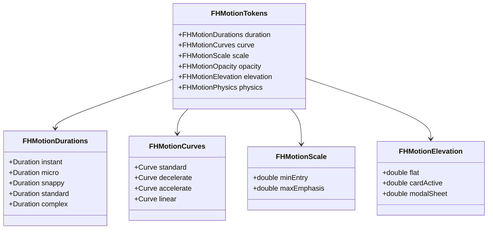
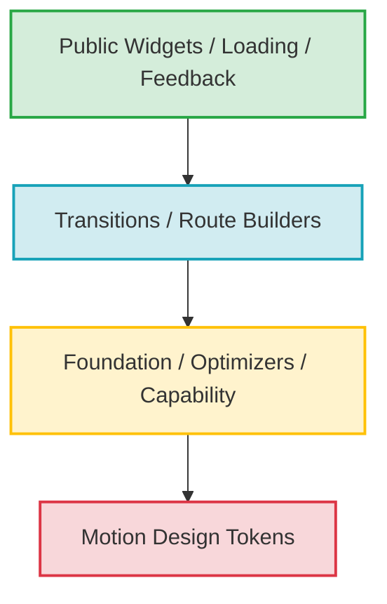
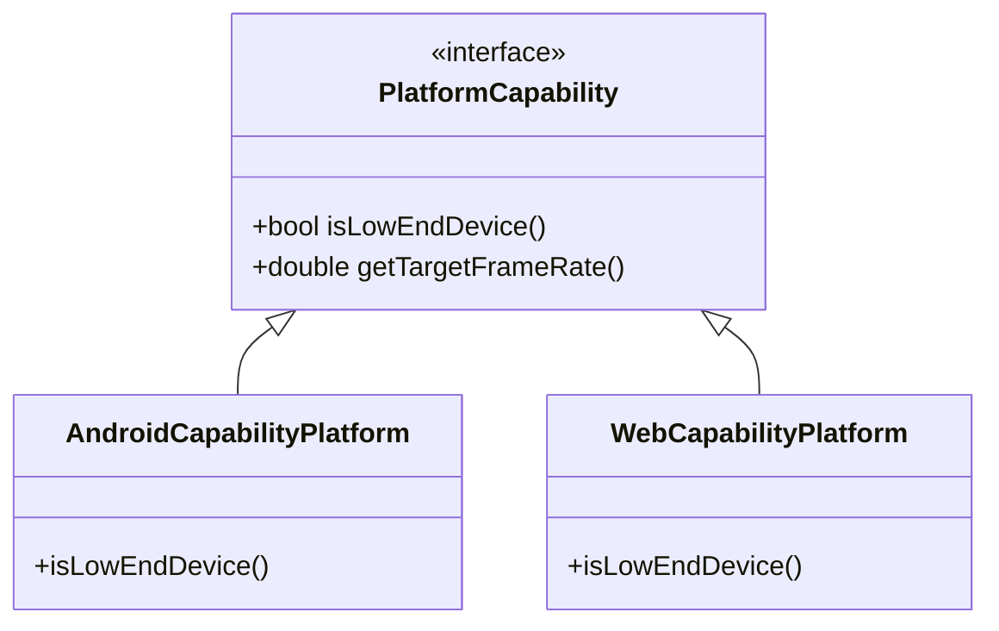
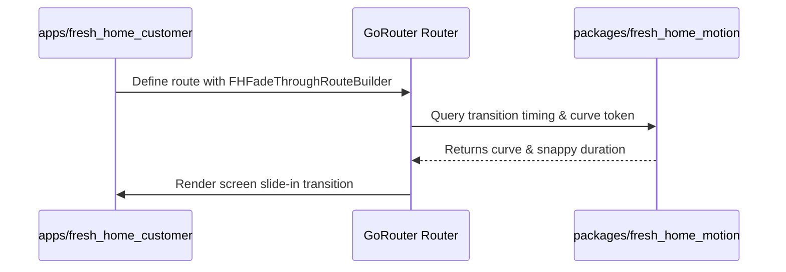

# Fresh Home Motion Foundation Architecture & Package Blueprint

This document specifies the architectural blueprint and directory structure for the future `fresh_home_motion` package. It defines the design guidelines, code boundaries, dependency layers, naming conventions, and api structures required to implement a robust, unified motion design system across the Fresh Home Flutter monorepo.

---

## 1. Purpose

The Fresh Home Motion Foundation exists to decouple motion properties and animation primitives from application business logic, layout templates, and third-party styling packages. It serves as a unified system to:
*   **Prevent UI Fragmentation:** Ensure that transitions, loaders, and micro-interactions exhibit identical curves and durations in all customer, technician, and admin panels.
*   **Enforce Performance Guardrails:** Standardize rendering optimizations (such as `RepaintBoundary` wrappers and non-layout triggers) at the package foundation level, so developers do not have to write custom optimization wrappers.
*   **Abstract Platform Differences:** Handle accessibility preferences (such as reduced motion) and device capabilities (such as downgrading transitions on low-end hardware) dynamically and transparently.
*   **Maximize Testability:** Decouple animation clocks from real-time timers, enabling deterministic UI automation testing in CI pipelines.

Every visual element in the Fresh Home ecosystem must rely on this package for physical movement and transition properties.

---

## 2. Package Responsibilities

To maintain clean architecture, `packages/fresh_home_motion` is strictly constrained to UI-agnostic presentation behavior.

```
┌─────────────────────────────────────────┐   ┌─────────────────────────────────────────┐
│     ALLOWED IN fresh_home_motion        │   │    FORBIDDEN IN fresh_home_motion       │
├─────────────────────────────────────────┤   ├─────────────────────────────────────────┤
│ ✔ Motion Tokens (Curves, Durations)     │   │ ❌ Business Logic / Cubits / Blocs      │
│ ✔ Generic Transition Widgets (FHFadeIn) │   │ ❌ Feature-specific Widgets (Booking)   │
│ ✔ Platform Accessibility Handlers       │   │ ❌ REST / RPC API Calls / Network Ops   │
│ ✔ Loading Primitives & Shimmer Effects  │   │ ❌ Direct App State / DB Cache Queries  │
│ ✔ Deterministic Animation Mock Helpers  │   │ ❌ Localization strings & translation   │
│ ✔ Depth, Opacity, and Transform helpers │   │ ❌ Third-party visual styling assets    │
└─────────────────────────────────────────┘   └─────────────────────────────────────────┘
```

---

## 3. Package Architecture & Folder Structure

The package directory structure separates the public API surface from internal code files, categorizing code by functional area:

```
packages/fresh_home_motion/
├── README.md
├── pubspec.yaml
└── lib/
    ├── fresh_home_motion.dart           # Public barrel export
    └── src/
        ├── foundation/
        │   ├── motion_config.dart       # Global engine configuration
        │   ├── motion_curves.dart       # Cubic Bezier math wrappers
        │   └── platform_capability.dart # Performance tier detector
        ├── tokens/
        │   ├── duration_tokens.dart     # Duration mappings
        │   ├── curve_tokens.dart        # CubicBezier mappings
        │   ├── scale_tokens.dart        # Max/Min scale constants
        │   ├── opacity_tokens.dart      # Transparency mappings
        │   └── elevation_tokens.dart    # Shadow & depth mappings
        ├── widgets/
        │   ├── animated_card.dart       # FHAnimatedCard base
        │   ├── fade_in.dart             # FHFadeIn primitive
        │   └── scale_transition.dart    # Snappy scale primitives
        ├── transitions/
        │   ├── route_transitions.dart   # Page route animation builders
        │   └── slide_transitions.dart   # Sheet slide animation builders
        ├── loading/
        │   ├── loading_indicator.dart   # FHLoadingIndicator base
        │   └── shimmer_effect.dart      # FHShimmer effect layout
        ├── feedback/
        │   ├── haptic_feedback.dart     # Snappy haptic wrappers
        │   └── sound_feedback.dart      # (Optional) Event sound mapping interfaces
        ├── utilities/
        │   ├── reduced_motion_ext.dart  # BuildContext accessibility extension
        │   └── repaint_optimizer.dart   # Custom repaint boundary helpers
        └── testing/
            ├── mock_clock.dart          # Deterministic time modifier
            └── controller_injector.dart # Testing hooks for controllers
```

---

## 4. Public API Philosophy

The package follows a **Closed-by-Default / Barrel Export** strategy. 

*   **Single-Point Import:** Developers must only import `package:fresh_home_motion/fresh_home_motion.dart`. Direct imports into `src/` are forbidden and will be flagged by project linter rules.
*   **Explicit Exports:** The `fresh_home_motion.dart` file uses selective `export` statements to expose only public widget classes, helper utilities, and the `FHMotionTokens` constants.
*   **Encapsulation of Implementations:** Private builders, complex math models, and platform-specific native hooks remain hidden inside `src/`. This prevents developers from relying on implementation details that could change during package updates.

---

## 5. Motion Tokens Organization

Tokens are organized into static namespaces to prevent identifier collision and ensure a clean autocomplete experience in IDEs.



### Namespace Definitions
1.  **`FHMotionTokens.duration`:** Maps to timing values (e.g., `FHMotionTokens.duration.snappy` = `200ms`).
2.  **`FHMotionTokens.curve`:** Maps to customized cubic curves (e.g., `FHMotionTokens.curve.decelerate` = `CubicBezier(0, 0, 0.2, 1.0)`).
3.  **`FHMotionTokens.scale`:** Holds absolute ratios for size shifts, capping entering scales at `0.95` to avoid large visual jumps.
4.  **`FHMotionTokens.opacity`:** Standardizes transitions for fade overlays, active status transparency, and disabled states.
5.  **`FHMotionTokens.elevation`:** Defines shadow transformations that scale in synchronization with the Z-axis height.
6.  **`FHMotionTokens.physics`:** Shared scrolling physics parameters for lists and viewport bounds.

---

## 6. Dependency Rules

To prevent coupling and dependency loops, code inside `fresh_home_motion` must only flow in one direction: **from high-level components down to low-level tokens.**



*   **Rule 1:** A widget (e.g., `FHLoadingIndicator`) may reference transitions and tokens.
*   **Rule 2:** A transition builder may reference foundation configurations and tokens.
*   **Rule 3:** The foundation layer may only import tokens.
*   **Rule 4:** Tokens must never import any widget, transition, or foundation logic. Tokens are pure data declarations.

---

## 7. Naming Standards

Every class, file, and folder in `packages/fresh_home_motion` must adhere to the following strict naming guidelines:

| Type | Case Rule | Prefix | Suffix | Examples |
| :--- | :--- | :--- | :--- | :--- |
| **Folders** | snake_case | None | None | `lib/src/tokens/`, `lib/src/loading/` |
| **Files** | snake_case | None | None | `animated_card.dart`, `curve_tokens.dart` |
| **Public Widgets** | PascalCase | `FH` | Widget Type | `FHAnimatedCard`, `FHLoadingIndicator` |
| **Private Widgets** | PascalCase | `_FH` | Widget Type | `_FHShimmerPainter`, `_FHRouteTransition` |
| **Tokens Namespace** | PascalCase | `FHMotion` | `Tokens` | `FHMotionTokens`, `FHMotionDurations` |
| **Route Builders** | PascalCase | `FH` | `RouteBuilder` | `FHFadeThroughRouteBuilder` |
| **Extensions** | PascalCase | `FH` | `Extension` | `FHReducedMotionContextExtension` |
| **Controllers** | PascalCase | `FH` | `Controller` | `FHMotionController` (if custom wrapper used) |

---

## 8. Public vs Internal API Boundary

The boundary between public components and internal details is protected by Dart imports:

*   **Public API (Declared in `lib/fresh_home_motion.dart`):**
    *   `FHMotionTokens` (Curves, timing constants).
    *   `FHLoadingIndicator`, `FHShimmer`, `FHFadeIn`, `FHAnimatedCard`.
    *   `FHFadeThroughRouteBuilder`, `FHSlideSheetRouteBuilder`.
    *   `FHReducedMotionContextExtension` (utility to check user accessibility status).
*   **Internal API (Hidden inside `lib/src/`):**
    *   `PlatformCapability` performance detection logic.
    *   `RepaintOptimizer` layout repaint boundaries.
    *   `mock_clock.dart` and internal unit-testing interfaces.
    *   Raw Bezier calculations and custom painters (`_FHShimmerPainter`).

---

## 9. Extensibility Strategy

To ensure that the motion package can support future enhancements without breaking applications:

*   **Open-Closed Principle for Tokens:** Add new tokens by extending subclasses or namespaces, keeping existing tokens untouched.
*   **Composition for Custom Widgets:** When implementing new features, combine core widgets (e.g., combining `FHFadeIn` and `Transform` layout shifts) instead of inheritance.
*   **Abstract Platform Overrides:** The foundation layer defines interface wrappers for hardware features. If a web platform or a new desktop client is added later, configure a platform-specific adapter without changing the widget layout logic:



---

## 10. Package Design Principles

All code written within this package must adhere to these architecture principles:

1.  **Single Responsibility (SRP):** An animation widget does one thing (e.g., `FHFadeIn` animates opacity; it does not handle card layout or color changes).
2.  **Composition Over Inheritance:** Complex animations are composed by wrapping multiple simple primitives rather than extending classes recursively.
3.  **Token-Driven Layout:** Timings, curves, and scaling coefficients must be queried from tokens. Hardcoded numbers are banned.
4.  **Accessibility First:** Reduced motion checks must be embedded in the core transition builder widgets. If reduced motion is active, widgets must skip layout movements automatically.
5.  **Performance First:** Layout paints are separated using `RepaintBoundary` wrappers inside continuous loading widgets.
6.  **Stateless Where Possible:** Widgets must remain `StatelessWidget` and accept external `Animation` properties or controllers to reduce memory footprint.
7.  **Deterministic Testing:** Widgets must accept standard configurations to run in unit test frameworks without depending on CPU real-time ticks.

---

## 11. Future Integration

The `fresh_home_motion` package will be integrated across apps and features inside the monorepo by following these rules:

*   **Zero Direct Dependency on Apps:** Apps (such as `apps/fresh_home_customer`) depend directly on `packages/fresh_home_motion`. The motion package must never depend on any app or feature.
*   **Integration via Shared Features:** Shared features (e.g., `packages/shared_features/lib/src/features/booking_flow`) import the motion package to animate screens and inputs.
*   **Routing System Bindings:** Define custom GoRouter transitions by passing `FHFadeThroughRouteBuilder` directly in the router setup of the respective applications.


