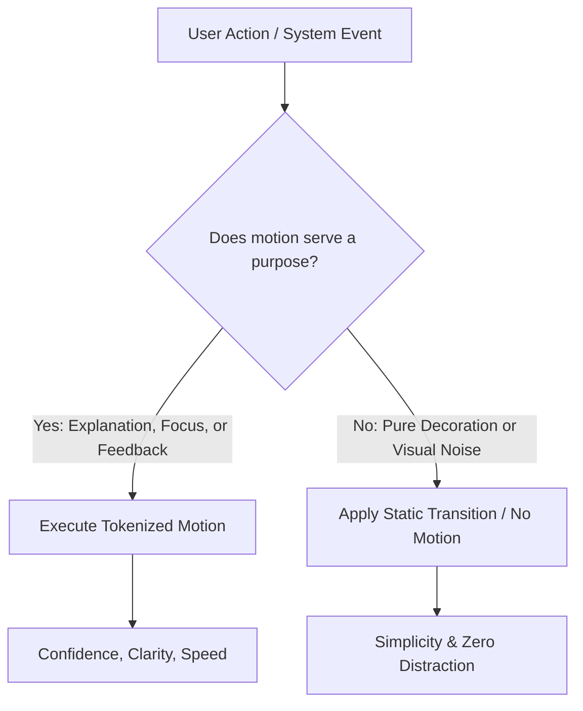
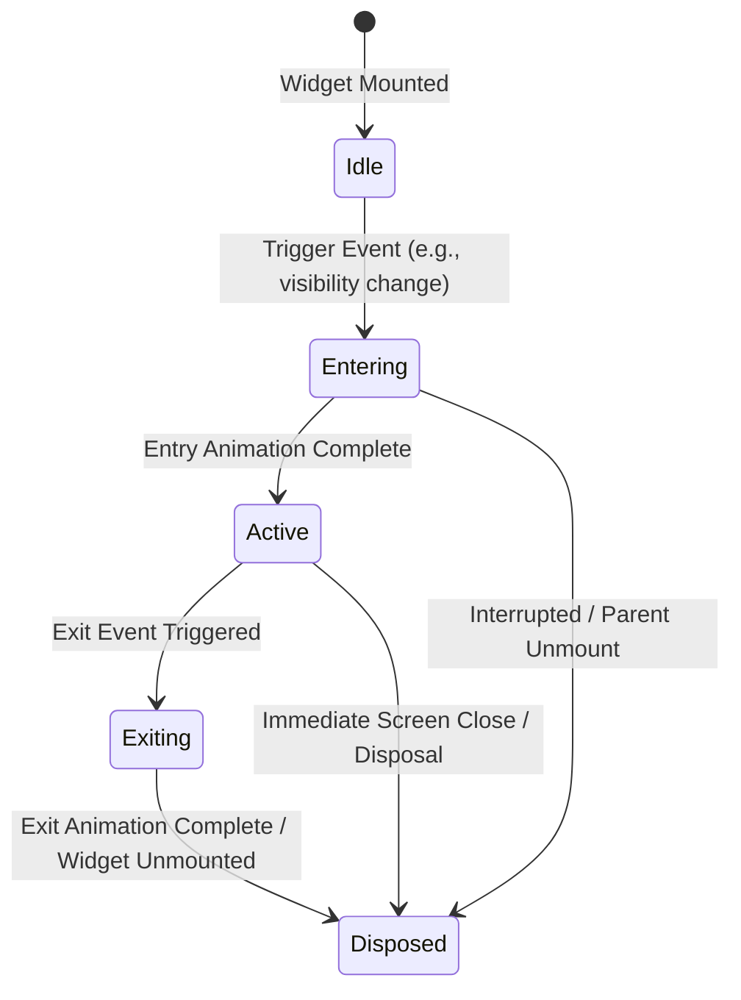
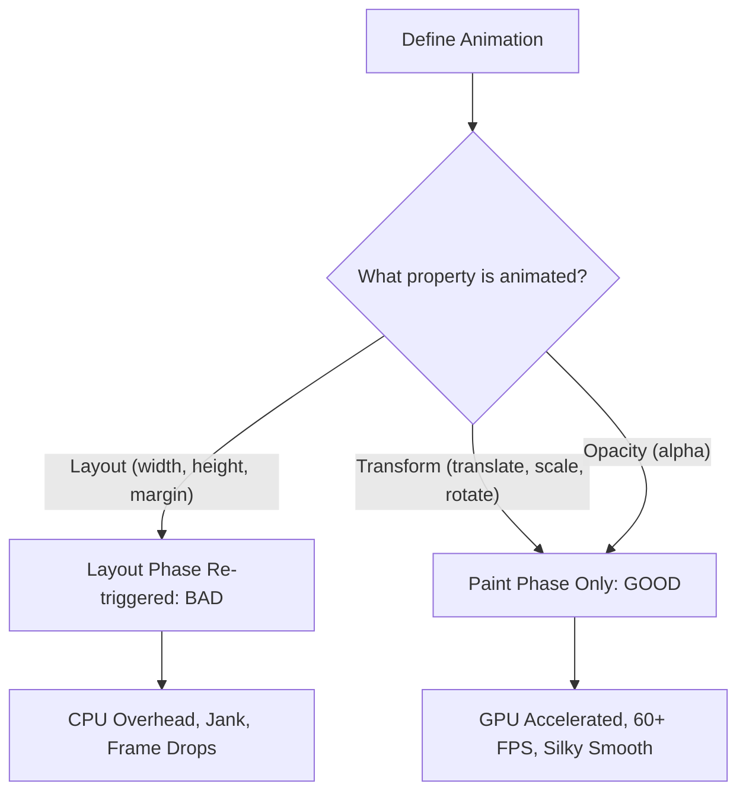

# Fresh Home Motion Design Philosophy & Engineering Standards

This document establishes the official Motion Design Philosophy and Engineering Standards for the Fresh Home platform. It governs all applications in the Fresh Home monorepo:
*   `apps/fresh_home_customer` (Customer Mobile App)
*   `apps/fresh_home_staff` (Technician Mobile App)
*   `apps/fresh_home_admin` (Admin Panel)
*   `apps/customer_web` (Customer Web App)
*   `packages/fresh_home_motion` (Dedicated shared motion package)
*   `packages/shared_features` (Shared UI modules)

---

## Table of Contents
1.  [Core Motion Vision](#1-core-motion-vision)
2.  [Brand Motion Identity & DNA](#2-brand-motion-identity--dna)
3.  [Motion Hierarchy](#3-motion-hierarchy)
4.  [Motion Design Tokens Philosophy](#4-motion-design-tokens-philosophy)
5.  [Timing, Curves & Styling Catalog](#5-timing-curves--styling-catalog)
6.  [Conceptual Animation Lifecycle](#6-conceptual-animation-lifecycle)
7.  [Visual Motion Budget (The "Less is More" Policy)](#7-visual-motion-budget-the-less-is-more-policy)
8.  [Motion Accessibility (A11y Core Standards)](#8-motion-accessibility-a11y-core-standards)
9.  [Performance Philosophy & Engineering Guardrails](#9-performance-philosophy--engineering-guardrails)
10. [Motion Testing & Verification Philosophy](#10-motion-testing--verification-philosophy)
11. [Monorepo Architecture & Naming Conventions](#11-monorepo-architecture--naming-conventions)
12. [Future Scalability & Platform Adaptivity](#12-future-scalability--platform-adaptivity)

---

## 1. Core Motion Vision

At Fresh Home, **motion is a core functional element of the user interface, not an ornament.** Every transition, state change, and feedback indicator must be designed to build trust, clarify system state, reduce perceived waiting time, and guide focus. If an animation does not improve usability, it must be removed.



### The Psychology of Fresh Home Motion
Users ordering home services are often looking for efficiency and dependability. Our animations must reassure users that their requests are being handled accurately and immediately. 
*   **Confidence:** UI elements do not shake, lag, or wobble. They move with purposeful, steady physics.
*   **Speed:** Action confirmations happen immediately, without artificial delays or long-running transition blocks.
*   **Transparency:** Transition pathways visually explain where elements come from and where they go, reducing the cognitive load of navigation.

---

## 2. Brand Motion Identity & DNA

The Fresh Home visual identity is built on three pillars: **Trustworthy**, **Fast**, and **Professional**. Our **Motion DNA** is the translation of these values into physical behaviors that establish emotional consistency and instant brand recognition across all devices.

```
                  ┌─────────────────────────────────┐
                  │      FRESH HOME MOTION DNA      │
                  └────────────────┬────────────────┘
                                   │
         ┌─────────────────────────┼─────────────────────────┐
         ▼                         ▼                         ▼
  [Direct Deceleration]     [Zero Elasticity]        [Spatial Anchoring]
  (Snappy entry, calm        (No cartoony bounce      (Elements emerge from
  decelerated settling)      or overshooting)          their source tap point)
```

### The Signature Motion: Direct Deceleration
Fresh Home's Signature Motion is the **Direct Deceleration**. In this movement, elements enter the screen rapidly to signify speed, but immediately and smoothly decelerate into place using a customized Cubic Bezier curve without any bounce, oscillation, or overshoot. This creates a feeling of instant response and ultimate control.

*   **Emotional Consistency:** The user should feel in control of the interface. Animations behave predictably and repeatably, reinforcing the professional quality of the service.
*   **Shared Visual Language:** Whether loading a screen in the Technician Mobile App or viewing analytics in the Admin Panel, elements expand and slide using the exact same velocity curves, linking the different apps into a singular brand experience.

---

## 3. Motion Hierarchy

To prevent visual clutter and organize rendering priority, animations are categorized into a strict hierarchy of motion importance.

```
┌─────────────────────────────────────────────────────────────────────────┐
│ 1. PRIMARY MOTION (Highest priority: Page Transitions, Modal Sheets)    │
├─────────────────────────────────────────────────────────────────────────┤
│ 2. SECONDARY MOTION (State Changes: Tab Swapping, Expandable Cards)     │
├─────────────────────────────────────────────────────────────────────────┤
│ 3. TERTIARY MOTION (Micro-interactions: Button press, Toggle switch)    │
├─────────────────────────────────────────────────────────────────────────┤
│ 4. BACKGROUND MOTION (Lowest priority: Skeleton shimmers, Live status)  │
└─────────────────────────────────────────────────────────────────────────┘
```

### A. Primary Motion (Critical Transitions)
*   **Definition:** Screen-to-screen transitions, system dialogues, and full-screen modal overlays (e.g., booking confirmation popups).
*   **Priority:** Highest. These transitions must execute cleanly, with all other minor animations temporarily paused to preserve CPU cycles.

### B. Secondary Motion (Layout Adaptations)
*   **Definition:** Intermediate layout shifts, such as expanding search filter cards, tab switching, and cascading list insertions.
*   **Priority:** Medium-High. Guides the user's focus during navigation within a single screen.

### C. Tertiary Motion (Micro-Feedback)
*   **Definition:** Direct button hover and press states, checkbox toggling, and input selection states.
*   **Priority:** Medium. Confirms interactive input and should complete almost instantaneously.

### D. Background Motion (Continuous Indicators)
*   **Definition:** Content shimmer loaders, live tracking status indicators, and background synchronizing cues.
*   **Priority:** Lowest. Must be throttle-controlled and subject to automatic fallback on low-end hardware.

---

## 4. Motion Design Tokens Philosophy

Using raw numeric values or inline animation curves is one of the most common causes of visual fragmentation and maintainability issues. 

```
❌ BAD (Hardcoded inline curves):
   _controller.animateTo(1.0, duration: Duration(milliseconds: 340), curve: Curves.easeOutBack);
   // Visual fragmentation, springy bounce violates guidelines, hard to scale or test.

✔️ GOOD (Tokenized styling):
   _controller.animateTo(1.0, duration: FHMotionTokens.durationSnappy, curve: FHMotionTokens.curveDecelerate);
   // Centralized control, complies with Motion DNA, fully testable and scalable.
```

### Why We Enforce Tokenization
1.  **Single Source of Truth:** If we decide to reduce all animations by 50ms to speed up the app experience, we can change a single token value in `packages/fresh_home_motion` and update the entire platform.
2.  **Cross-Platform Alignment:** Design tokens are parsed directly into Flutter classes (`Duration`, `Curve`) and Web CSS variables, guaranteeing that a "Snappy" transition is exactly the same on Mobile and Web.
3.  **Strict Compliance:** Developers do not have to guess timings or curves; they are forced to select from the token palette.

---

## 5. Timing, Curves & Styling Catalog

All tokens are defined centrally in `packages/fresh_home_motion/lib/src/tokens/motion_tokens.dart`.

### A. Curve Tokens
We use customized cubic bezier curves to enforce our calm and professional personality. **Spring or bounce curves are prohibited.**

| Token Name | Bezier Value | Primary Behavior |
| :--- | :--- | :--- |
| `FHMotionTokens.curveStandard` | `CubicBezier(0.20, 0.00, 0.20, 1.00)` | Used for standard layout movements (e.g., expanding cards, sliding drawers). |
| `FHMotionTokens.curveDecelerate` | `CubicBezier(0.00, 0.00, 0.20, 1.00)` | Used for elements entering the viewport. It starts rapidly, then decelerates. |
| `FHMotionTokens.curveAccelerate` | `CubicBezier(0.40, 0.00, 1.00, 1.00)` | Used for elements exiting the viewport. It starts slowly, then accelerates. |
| `FHMotionTokens.curveLinear` | `Linear` | Used exclusively for continuous loops, such as progress shimmers. |

### B. Timing Tokens (Durations)
Timing must be kept short to ensure the app feels fast and lightweight.

| Token Name | Value | Primary Use Cases |
| :--- | :--- | :--- |
| `FHMotionTokens.durationInstant` | 0ms | Used for instant state changes where animation adds no value. |
| `FHMotionTokens.durationMicro` | 100ms | Button scale feedback, hover states, checkbox transitions, and toggles. |
| `FHMotionTokens.durationSnappy` | 200ms | Small card expansions, tooltip entries, list-item insertions. |
| `FHMotionTokens.durationStandard` | 250ms | Bottom sheet slides, dialog popups, page transitions. |
| `FHMotionTokens.durationComplex` | 300ms | Multi-stage booking flow step changes, large layout transformations. |

### C. Visual Styling Tokens (Scale, Opacity, Elevation)
Consistent transitions require matching spatial transitions.
*   **Scale Limits:** The scale of entering elements must never exceed a range of `0.95x -> 1.0x` (no scaling down from huge values).
*   **Opacity curve:** Use linear fade overlayed with deceleration translation.
*   **Elevation transitions:** Depth changes (shadow scaling) must decelerate synchronously with scale to avoid visual detachment.

---

## 6. Conceptual Animation Lifecycle

Every animated widget in the Fresh Home platform must strictly adhere to the following conceptual lifecycle. This prevents CPU leaks, handles premature disposal, and ensures smooth exit animations:



1.  **Idle State:** The widget is mounted but waiting for trigger criteria (e.g., user tap, list load). Controllers remain uninitialized or set to 0.0.
2.  **Entering State:** The animation controller runs using the `curveDecelerate` curve. **Rule:** If the parent widget is unmounted during this phase, the animation controller must immediately stop playing to avoid memory leakage.
3.  **Active State:** The animation is stable. Loop controls are active (if background).
4.  **Exiting State:** The animation controller plays in reverse or plays an exit sequence using the `curveAccelerate` curve. **Rule:** User interactions on the exiting widget must be immediately disabled to prevent double-taps.
5.  **Disposed State:** **Rule:** All `AnimationController` resources, listeners, and tickers must be explicitly disposed of in `dispose()` to prevent persistent CPU background ticks.

---

## 7. Visual Motion Budget (The "Less is More" Policy)

To maintain a clean design and avoid visual noise, every screen layout is bound to a strict motion budget.

### Motion Budget Limits
1.  **Attention-Grabbing Limit:** There must never be more than **one** active attention-grabbing animation on a screen at any given time (e.g., a pulsing notification badge or an animated tutorial guide).
2.  **Micro-Animation Cap:** No screen may contain more than **two** background loops or passive indicators (e.g., a flashing live-tracking dot + a typing indicator).
3.  **Background Motion Rule:** Purely cosmetic background animations (e.g., animated gradients, floating particles, video backgrounds) are **completely banned**.
4.  **Loading Overload Rule:** When content is loading, use static skeleton placeholders with a subtle linear shimmer. Never mix spinning wheels with shimmers or multiple spinners on the same page.
5.  **Idle Animations:** UI elements must be completely static when the user is inactive. Pulse or wiggle effects on buttons to "invite" taps are forbidden.

---

## 8. Motion Accessibility (A11y Core Standards)

We must ensure our applications are comfortable and safe for all users, including those with cognitive, visual, or vestibular conditions.

### Accessibility Rules
*   **Respect System Settings (`Reduced Motion`):**
    *   Applications must query system accessibility properties.
    *   If the user has enabled "Reduce Motion" on their device, all slide, scale, and multi-axis transitions must be bypassed. They must be replaced with instant changes or subtle opacity fades capped at **100ms**.
*   **Never Rely Solely on Motion:**
    *   An animation must never be the only indicator of success, error, or state change. 
    *   Always accompany transitions with clear static labels, icons, or changes in textual description.
*   **Avoid Vestibular Sickness:**
    *   Animations must not rotate elements in 3D space, stretch layouts, or scale elements above **1.1x**.
    *   Flashing or blinking loops must never exceed a frequency of **3Hz** (3 times per second).
*   **Maintain Readability:**
    *   Never animate text properties like font weight, letter spacing, or line height, as this triggers continuous text reflow and causes visual vibration.
    *   During screen-to-screen transitions, text elements must slide or fade as a single block.

---

## 9. Performance Philosophy & Engineering Guardrails

Animations that drop frames make the application feel cheap and unoptimized. The following engineering rules are mandatory for all Flutter and Web frontend code:

### Target Performance Metrics
*   **Frame Rate:** Maintain a solid **60 FPS** (or 90/120 FPS on compatible displays).
*   **Frame Drop Limit:** No basic UI animation may drop more than 2 frames in a single transition sequence.



### Flutter Optimization Guidelines
1.  **Animate Off-Layout Properties:** 
    Never animate properties that trigger layout passes (e.g., `width`, `height`, `padding`, `margin`, `alignment`). Instead, animate `Transform.translate`, `Transform.scale`, `Transform.rotate`, and `Opacity` which only trigger the paint phase and are offloaded to the GPU.
2.  **Utilize `RepaintBoundary`:**
    Wrap frequently updated animations (such as live timers, shimmers, or custom painters) in a `RepaintBoundary` to prevent the rest of the widget tree from repainting.
3.  **Optimize `AnimatedBuilder`:**
    Always extract static child trees and pass them via the `child` parameter of `AnimatedBuilder`. This ensures the child subtree is not rebuilt on every frame.
4.  **Avoid Expensive Operations during Animations:**
    Do not invoke image decoding, storage reads, network requests, or database queries while an animation is actively playing.
5.  **Limit Clipping Operations:**
    Avoid animating widgets wrapped in complex `ClipRRect`, `ClipPath`, or high-radius `BoxShadow` layers, as path-clipping and shadow blending are highly CPU-intensive on low-end mobile devices.

---

## 10. Motion Testing & Verification Philosophy

To ensure that motion updates do not introduce performance regressions or timing errors, all components in `packages/fresh_home_motion` must be fully testable in CI pipelines.

### A. Deterministic Animation Rules
*   All animation timings must depend strictly on the system's mockable clock. No animation should rely on real-time asynchronous background clocks.
*   **Controller Injection:** Reusable animated widgets must accept an optional, external `AnimationController` or `Animation` curve parameter. This allows testing suites to inject mocked animations and verify specific keyframe states.

### B. Widget & Goldens Testing Standards
*   **Time Dilation:** In unit/widget tests, utilize Flutter's `binding.timeDilation` or Web test runners to accelerate animation timescales.
*   **Deterministic Frame Validation:** Widget tests must assert that when `timeDilation = 1.0`, the widget reaches the final visual state in exactly the duration specified by the assigned token (e.g., asserting a snappy card completes expansion in exactly 200ms).
*   **Memory Leak Verification:** Running unit tests must verify that unmounting an animation widget cleans up all registered tickers.

---

## 11. Forbidden Practices (The "Never Do" List)

To ensure the Fresh Home platform remains clean, fast, and professional, the following visual behaviors are strictly forbidden:

```
❌ NO BOUNCE OR SPRING:
   [Element] ===> [Impact Point] ===(Wobbles & Bounces back and forth)===> [Stable]
   (Feels childish, distracting, and slows down operational task completion)

✔️ Snappy Linear Easing:
   [Element] ===(Smoothly decelerates to exact point)===> [Stable]
   (Feels professional, fast, and secure)
```

### Detailed Forbidden List
*   **Excessive Bounce & Over-shooting:** Do not use spring physics that cause components to bounce past their target boundaries. This feels childish and distracts from core operations.
*   **Un-tokenized/Random Values:** Never define inline durations (e.g., `340ms`) or custom curves directly in UI screens. Every animation must reference a standard design token.
*   **Blocking Interaction States:** Animations must never block user inputs. If an animation is playing, the user must still be able to tap a button, close a drawer, or cancel the action immediately.
*   **Cascading Stagger Lists > 5 Items:** Staggered list animations (where each list item slides in one by one) must not exceed 5 items. Animating more than 5 items creates unnecessary wait times and causes frame rate drops.
*   **Continuous Rotating Loops:** Do not use constantly rotating icons (e.g., rotating settings gears or syncing arrows) as passive state indicators. They create anxiety and make the user feel like the app is stuck in an infinite loop.

---

## 12. Monorepo Architecture & Naming Conventions

Consistency requires clean code separation. All motion tokens, curves, and standard transition widgets must be defined within the dedicated shared motion package.

```
┌──────────────────────────────────────────────────────────┐
│                      APPLICATIONS                        │
│ apps/customer_mobile  apps/staff_mobile  apps/admin_web  │
└────────────────────────────┬─────────────────────────────┘
                             │ (Imports only)
                             ▼
┌──────────────────────────────────────────────────────────┐
│                   packages/shared_features               │
│ (Reuses standard animations; NO app-specific logic)       │
└────────────────────────────┬─────────────────────────────┘
                             │ (Imports only)
                             ▼
┌──────────────────────────────────────────────────────────┐
│                 packages/fresh_home_motion               │
│ - FHMotionTokens (Curves, Durations, Scales)             │
│ - lib/src/widgets/ (e.g., FHFadeIn, FHShimmer)           │
└──────────────────────────────────────────────────────────┘
```

### Coding Boundary Rules
1.  **No Custom Definitions in Apps:** Apps in `apps/` must never define custom `AnimationController` timing constants or custom `Curve` curves. They must consume variables from the `FHMotionTokens` library.
2.  **Shared Features Compliance:** Any screen or widget inside `packages/shared_features` must use the unified transition widgets. They must not introduce proprietary animations that cannot be shared with other features.

### Naming Conventions
All widgets and configurations related to motion must adhere to standard naming prefixes and suffixes to distinguish them in the codebase:

1.  **Widget Classes:** Prefix all widgets with `FH` and suffix with their animation type.
    *   *Examples:* `FHFadeIn`, `FHShimmer`, `FHLoadingIndicator`, `FHAnimatedCard`.
2.  **Token Classes:** All design tokens must reside inside the `FHMotionTokens` class.
    *   *Examples:* `FHMotionTokens.durationSnappy`, `FHMotionTokens.curveDecelerate`.
3.  **Curve Builders:** Transition transition helpers must be suffixed with `RouteBuilder` or `TransitionBuilder`.
    *   *Example:* `FHFadeThroughRouteBuilder`.

---

## 13. Future Scalability & Platform Adaptivity

As Fresh Home grows, our motion design must scale across multiple form factors (small phone screens, tablets, desktop browsers) and varying input methods.

### A. Screen Size Adaptivity
*   **Compact Devices (Mobile):** Keep translation distances short (e.g., translate elements by 10-20 pixels rather than sliding across the entire screen). This prevents visual disorientation on small panels.
*   **Large Screens (Tablet & Web/Desktop):** Motion should be localized. If a user clicks a button on the right side of a widescreen display, the visual response must stay on the right, not trigger a full-screen transition that strains the user's field of view.

### B. Input Device Adaptivity
*   **Touch Input (Mobile/Tablet):** Focus on immediate feedback upon touch release. Keep visual scales small and direct.
*   **Cursor Input (Web/Desktop):** Leverage subtle hover transitions (duration: `FHMotionTokens.durationMicro` of 100ms) to indicate clickability. Keep cursor-following animations or magnetic buttons completely disabled.
*   **Low-End Devices:**
    The shared animation layer must check the processor/memory tier of the device (or catch frame rate drops below 30 FPS). If a low-end environment is detected, the app must automatically downgrade transitions to simple opacity swaps or disable shimmers entirely to preserve responsiveness.
