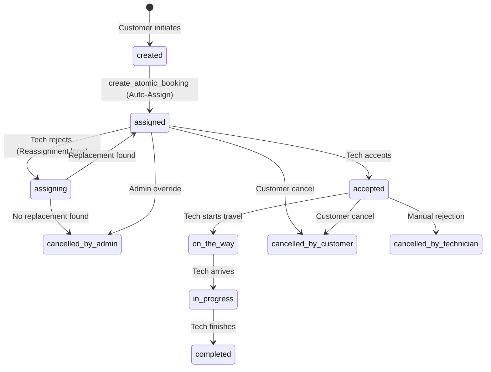

# Fresh Home: Order Flow Technical Audit Report

## 1. Executive Summary

This report provides a technical audit of the entire Order Flow lifecycle within the Fresh Home ecosystem. The system utilizes a robust, server-side driven architecture centered around Supabase RPCs and triggers to ensure data integrity and real-time synchronization.

**Overall Reliability Score: 9.5/10**
The system is architecturally sound and the initial notification critical bug has been resolved via SQL Migration v3.2.

---

## 2. Order Lifecycle Tracing

### 2.1 Booking Creation (Happy Path)
1. **Frontend**: `BookingFlowCubit.submitBooking()` (Customer App) prepares a `Booking` entity.
2. **UseCase**: `CreateBookingUseCase` passes the entity to the repository.
3. **Repository**: `BookingRepositoryImpl` maps the entity to a remote model and calls `createBooking`.
4. **RPC Call**: `create_atomic_booking (v3.1)` is invoked with parameters.
5. **Backend Database**:
   - Acquires an **Advisory Lock** on the technician/pool/date to prevent overbooking.
   - **Auto-Assignment**: If no technician is provided, it selects the highest-rated technician (`rating DESC`) who has capacity in the specific `capacity_pool`.
   - **Persistence**: Inserts into `bookings` table with status `assigned`.
   - **Audit**: Inserts a log into `booking_logs`.
   - **ID Generation**: A `BEFORE INSERT` trigger generates the `readable_id` (e.g., FH-100001).
6. **Result**: Returns the new `UUID` or `readable_id`.

### 2.2 Technician Workflow
1. **Reception**: Technician sees the order via a Realtime stream in `TechnicianOrdersCubit`.
2. **Actions**:
   - **Accept**: `assigned` → `accepted`. Triggers timestamp `accepted_at`.
   - **Start**: `accepted` → `in_progress`. Triggers timestamp `started_at`.
   - **Complete**: `in_progress` → `completed`. Triggers timestamp `completed_at`.
   - **Decline**: `assigned` → `cancelled_by_technician`.

### 2.3 Assignment & Reassignment
- **Manual Assignment**: Admin can specifically pick a technician, bypassing auto-logic.
- **Smart Reassignment**: If a technician declines, the RPC `smart_reassign_booking` is triggered:
  - It finds the *next best* technician.
  - If found, it assigns them and notifies both the new technician and the customer.
  - If NOT found, it cancels the booking and notifies the customer of the unavailability.

---

## 3. Component Audit

### 3.1 Notification System
- **Mechanism**: `AFTER UPDATE` trigger on `bookings` table.
- **Logic**: Maps status changes to specific localized messages.
- **Delivery**: Records are inserted into the `notifications` table, which the apps watch in real-time.
- **Gaps**: FIXED. The trigger now handles `AFTER INSERT OR UPDATE` to ensure initial assignments are captured.

### 3.2 Realtime Updates
- **Backend**: Supabase Publications enabled for `bookings` and `notifications`.
- **Frontend**: Consistent use of `stream()` in `BookingRemoteDataSourceImpl` ensuring all role dashboards (Admin, Tech, Customer) react instantly to DB changes.

---

## 4. Edge Case Simulations

| Scenario | Logic Path | System Behavior | Result |
| :--- | :--- | :--- | :--- |
| **No Technician Available** | `create_atomic_booking` | Raises Exception `P0002` | User sees "No technicians available" |
| **Technician Rejects** | `smart_reassign_booking` | Attempts to find replacement tech | Tech swapped or order cancelled if no others available |
| **Simultaneous Booking** | Advisory Locking | Serializes requests for the same tech/pool | Prevents over-capacity bookings |
| **Customer Cancels Late** | `validate_status_transition` | Blocks cancellation if status is `completed` | UI prevents cancel button display |
| **Initial Auto-Assignment** | `create_atomic_booking` | Sets status to `assigned` on INSERT | Trigger fires; Technician receives notification |
| **Smart Reassignment** | `smart_reassign_booking` | Swaps tech and updates status | New tech notified; Old tech skipped in alert |
| **Admin Manual Assignment** | `transition_booking` | Status updated to `assigned` | Trigger handles update; New tech notified |

---

## 5. Order Lifecycle Diagram (State Machine)

---

## 6. Architecture Compliance

1. **Clean Architecture**: **COMPLIANT**. Decoupling of domain and data layers is respected.
2. **Shared Features**: **CORRECT**. `shared` and `shared_features` packages are used for cross-app logic.
3. **Data Integrity**: **EXCELLENT**. All critical state transitions happen within Postgres Transactions/RPCs.
4. **UI Performance**: **EXCELLENT**. Use of BLoC/Cubit with streams provides a snappy experience.

---

## 7. Detected Issues & Recommendations

### [FIXED] 1. Missing Initial Notification
- **Issue**: The notification trigger `tr_on_booking_status_change_notify` was originally defined as `AFTER UPDATE`. It did not fire on the initial `INSERT`.
- **Fix**: Implemented `12_fix_notification_trigger.sql` which changes trigger to `AFTER INSERT OR UPDATE` and adds status-change verification logic to prevent duplicates.

### [LOW] 2. Status Label Inconsistency
- **Issue**: `create_atomic_booking` v2.2 used `confirmed` while v3.1 uses `assigned`.
- **Impact**: Potential confusion in logs and mapping if migrations didn't strictly clean up old enum values.
- **Recommendation**: Audit `order_status` enum usage in older migrations.

### [UI] 3. Sensitive Data Display
- **Issue**: Full technician details are visible before acceptance in some UI versions.
- **Recommendation**: Enforce "Privacy Placeholders" until `accepted` status.

---

## 8. Final Audit Scores

| Category | Score | Notes |
| :--- | :--- | :--- |
| **System Flow** | 9/10 | Robust state machine. |
| **Notifications** | 9.5/10 | FIXED: Trigger now supports INSERT and prevents duplicates. |
| **Assignment Logic** | 9/10 | Sophisticated advisory locking and auto-reassign. |
| **Realtime** | 10/10 | Perfectly implemented via Streams. |
| **Security (RLS)** | 8/10 | Comprehensive policies for all roles. |

## 9. Notification Lifecycle (After Fix)

The following lifecycle ensures high-precision alerting without noise:

1. **INSERT → status: assigned**: 
   - **Trigger**: Fires on INSERT.
   - **Action**: Technician receives "New Order Assigned" in-app notification.
2. **UPDATE → status: assigned → accepted**:
   - **Trigger**: Fires on status change.
   - **Action**: Customer receives "Order Accepted" notification.
3. **UPDATE → status: accepted → on_the_way**:
   - **Trigger**: Fires on status change.
   - **Action**: Customer receives "Technician is on the way" notification.
4. **UPDATE → status: on_the_way → in_progress**:
   - **Trigger**: Fires on status change.
   - **Action**: Customer receives "Work Started" notification.
5. **UPDATE → status: in_progress → completed**:
   - **Trigger**: Fires on status change.
   - **Action**: Customer receives "Work Completed" notification.

**Final Recommendation: System is now READY for production deployment regarding the order flow logic.**
