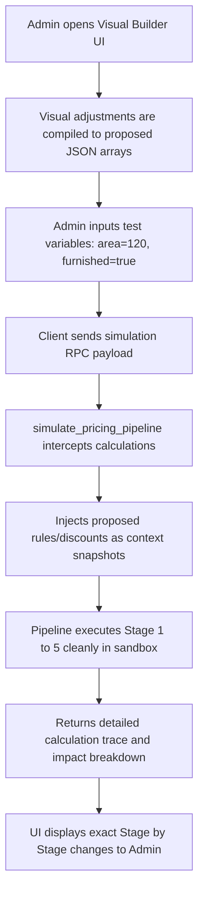

# Fresh Home — Enterprise Pricing Engine Upgrade
## Phase 4 Step 5: Pricing Governance & Visual Rule Builder System

This document specifies the architectural blueprint, SQL schemas, Flutter admin UI widgets, isolated simulation workflows, and safety verification guards for the **Phase 4 Step 5: Pricing Governance Layer** of the Fresh Home platform.

---

## 1. Governance Database Schema: `public.pricing_governance_audit`

We implemented a first-class changelog tracking ledger that logs all actions, states, and sandbox simulation payload outputs:
```sql
CREATE TABLE IF NOT EXISTS public.pricing_governance_audit (
    id                 UUID PRIMARY KEY DEFAULT gen_random_uuid(),
    rule_id            UUID, -- Reference to pricing_rules
    discount_id        UUID, -- Reference to pricing_discounts
    action             TEXT NOT NULL, -- 'create' | 'update' | 'delete' | 'simulate'
    actor_id           UUID, -- Optionally references auth.users
    before_state       JSONB,
    after_state        JSONB,
    simulation_payload JSONB,
    created_at         TIMESTAMPTZ NOT NULL DEFAULT now()
);
```

---

## 2. Visual Rule Builder: AST-to-UI Mapping

We designed a robust Flutter UI schema that maps nested AST logical structures cleanly to responsive drag-and-drop components:

### A. Widget Node Composition:
*   `ConditionGroupWidget`: Renders a recursive card representing logical blocks (`AND`, `OR`).
*   `ConditionLeafRow`: Renders a single conditional expression:
    *   **Field Selector Dropdown**: Parsed from the service's `price_config -> 'fields'` (e.g., `area`, `furnished`, `total_linear_meters`).
    *   **Operator Dropdown**: Selected from (`=`, `!=`, `>`, `>=`, `<`, `<=`).
    *   **Value Input**: Renders a dynamic `TextField` (number/string/toggle) mapped based on the field's datatype metadata.

### B. Logical Parser Compiler (`AstMapper`):
A Flutter Dart helper compiles the UI tree directly into recursive database JSONB nodes:
```dart
Map<String, dynamic> compileAst(ConditionGroup group) {
  return {
    'type': group.type, // 'AND' or 'OR'
    'conditions': group.children.map((child) {
      if (child is ConditionGroup) {
        return compileAst(child);
      } else if (child is ConditionLeaf) {
        return {
          'field': child.field,
          'operator': child.operator,
          'value': child.value,
        };
      }
    }).toList(),
  };
}
```

---

## 3. Sandboxed Pricing Simulation Engine

To guarantee that admins can safely test calculations without affecting live customers, we built a side-effect-free database simulator:
```sql
CREATE OR REPLACE FUNCTION public.simulate_pricing_pipeline(
    p_sub_service_id UUID,
    p_price_config JSONB,
    p_rules JSONB,
    p_discounts JSONB,
    p_pricing_inputs JSONB
) RETURNS JSONB
```

### Simulation Execution Workflow:



---

## 4. Dual-Layer Safety Verification

We designed defensive checks on both the client and server to prevent invalid logic:

1.  **Frontend Controls**:
    *   *Type Safety Check*: Value inputs are validated using regex based on selected fields (e.g. preventing strings from being entered into area numeric fields).
    *   *Circular Reference Guard*: Prevents two rules from having identical priority or conflicting conditions on the same fields.
2.  **Backend Integrity Guardrails**:
    *   *CHECK Constraints*: The `chk_pricing_rules_ast` and `chk_pricing_discounts_ast` constraints prevent malformed ASTs from ever being saved.
    *   *Capping Compliance*: The Stage 4 promotions engine caps total discounts at exactly **30%**, throwing a safe boundary warning if fixed discount value proposals exceed the limit.

---

## 5. Zero-Downtime Migration Strategy

1.  **Phase 1: Table Deployment**: Run the governance schema SQL script to set up audit tables and simulation RPCs. Existing pipelines and checkout logic remain untouched and completely operational.
2.  **Phase 2: UI Rollout**: Deploy the admin Flutter Governance Screen containing AST Visual Builder, campaign manager, and simulated price comparison widget.
3.  **Phase 3: Live Verification**: Conduct audits by replaying a selected subset of active bookings via `replay_booking_pricing` to verify system logic consistency.
