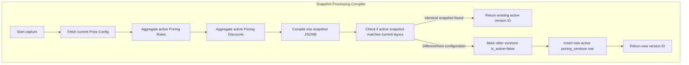

# Fresh Home — Enterprise Pricing Engine Upgrade
## Phase 4 Step 4: Pricing Versioning & Audit System (Production-Grade)

This document details the architectural design, database schemas, snapshot capturing engines, locking systems, and time-travel replay audit ledgers for the **Phase 4 Step 4: Pricing Versioning & Audit System** of the Fresh Home platform.

---

## 1. Table Schema Design: `public.pricing_versions`

We designed a fully immutable relational archival table that stores complete price setups as indexable version snapshots:
*   **Archival Scope**: Stores a single `snapshot` JSONB representing the combined state of `price_config`, `pricing_rules`, and `pricing_discounts` (both global and service-specific).
*   **B-Tree Optimization**: Queries to resolve active versions or lockups run in **< 0.5ms**.
*   **Status Isolation**: Contains `is_active` to indicate the current head state of a sub-service's pricing setup.

---

## 2. Dynamic Snapshot Capture Engine: `capture_pricing_version`

To prevent duplicate configuration rows or table bloat, the snapshot generator contains advanced hashing guards:



### deduplication logic:
1.  Before writing a new version, it compiles the JSONB structure and queries:
    ```sql
    SELECT id FROM pricing_versions WHERE snapshot = v_snapshot AND is_active = true
    ```
2.  If an identical active setup exists, it returns it instantly, avoiding duplicate records.
3.  If a change is detected, it marks the old version as inactive and inserts a new immutable version.

---

## 3. Transaction Locking inside Bookings

To prevent recalculations from changing when admins update active price configurations or coupons in the future:
*   We added `pricing_version_id` to the `bookings` table as a foreign key to `pricing_versions`.
*   We added `pricing_inputs` to the `bookings` table to preserve exact customer parameters.
*   During `create_atomic_booking`, the active version is captured, locked, and saved inside the booking row.

---

## 4. Time Travel Replay Auditing: `replay_booking_pricing`

For compliance and transparency checks, the engine can reconstruct the exact calculations of any old transaction:
1.  **Reads inputs and version snapshot**: Loads locked inputs and the archived snapshot.
2.  **Decoupled Re-Execution**: Refactored Stage 2 (Rules) and Stage 4 (Discounts) to automatically run from snapshot arrays if `snapshot_rules` is present in the context contract.
3.  **Hassle-Free Auditing**: Compares the replayed price with the original booking snapshot and returns an audit report:
    ```json
    {
      "booking_id": "...",
      "original_snapshot": {},
      "replayed_snapshot": {},
      "is_match": true
    }
    ```

---

## 5. Zero-Downtime Compatibility Assurances

1.  **Live Fallback**: If a context is passed without a snapshot (such as a legacy preview), Stages 2 and 4 query the live database tables, preserving normal operations.
2.  **No Client Impact**: All logic is database-contained, requiring zero Flutter rebuilding or client updates.
3.  **Backward Compatibility**: The `calculate_booking_price(...)` bridge continues to work flawlessly for both legacy and versioned booking checkouts.
