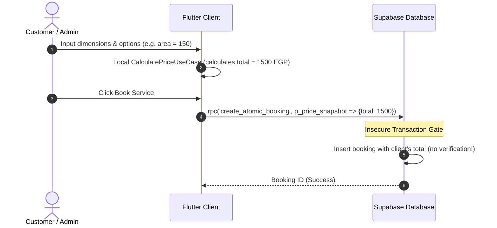
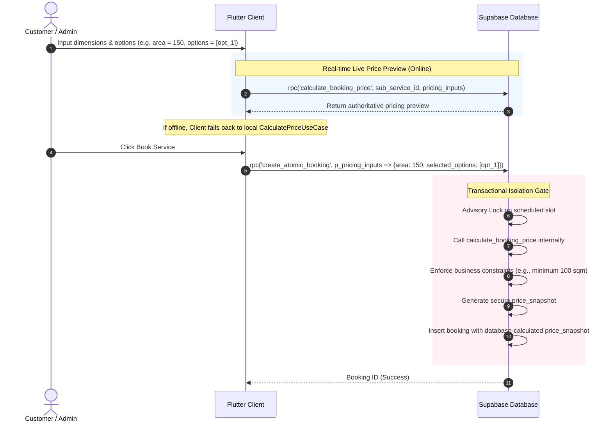

# Fresh Home — Architectural Upgrade Report
## Secure Server-Side Pricing Validation & Booking Protection (Phase 1)

> [!IMPORTANT]
> This document details the completed architectural upgrade that successfully migrates all pricing authority from the Flutter client application to the Supabase PostgreSQL backend. It eliminates a critical financial vulnerability where client-side price tampering was possible.

---

## 1. Executive Summary & Vulnerability Analysis

### The Legacy Vulnerability (Vulnerable Client-Authoritative Pricing)
In the original architecture, the Flutter application calculated the final price using its local `CalculatePriceUseCase` and sent a completed `price_snapshot` payload directly to the database via the `create_atomic_booking` RPC. The backend blindly accepted this client-provided total and wrote it into the `bookings` table.
*   **Vulnerability Type**: Insecure Direct Object Reference (IDOR) / Parameter Tampering.
*   **Financial Impact**: Critical. Malicious actors could intercept or modify client-side requests using simple proxy tools (e.g., Charles Proxy, Burp Suite) or code injection, setting booking prices to zero or arbitrary low numbers.
*   **Architectural Failure**: Trusting the client as an authority for financial calculations and transactional data.

### The Hardened Solution (Server-Authoritative Pricing Gate)
Under the new architecture, **the client is stripped of all pricing authority**.
1.  **Generic Pricing Input Contract**: The client now submits only raw, uncalculated user parameters (such as `area`, `windows`, `selected_options`) through a generic input contract.
2.  **Server-Side Price Engine**: A secure, isolated database function `public.calculate_booking_price` executes inside Supabase, validating parameters and calculating the price against standard database price configurations.
3.  **Transactional Gate**: The booking submission endpoint `public.create_atomic_booking` has been refactored to accept raw `p_pricing_inputs` instead of `p_price_snapshot`. The backend calculates and validates the price *during* the booking transaction, writing its own authoritative price snapshot directly to the database.

---

## 2. Architectural Comparison Diagrams

Here is a visual comparison of the system workflows before and after the architectural upgrade.

### Legacy Workflow (Vulnerable)


### Hardened Workflow (Secure & Transactional)


---

## 3. Generic Pricing Input Contract Spec

To avoid service-specific DTO explosion (e.g., `CleaningInputs`, `MaintenanceInputs`), we established a highly flexible, generic pricing input contract that accommodates current and future service models.

### JSON Structure Specification
```json
{
  "area": 120.5,
  "total_linear_meters": 15.0,
  "windows": [
    {
      "width": 1.5,
      "height": 1.2,
      "quantity": 2,
      "is_both_sides": true
    }
  ],
  "selected_options": [
    "opt_deep_steam",
    "opt_eco_detergent"
  ]
}
```

### Input Field Mapping Rules

| Field Name | Type | Unit | Description | Applied Service Type |
| :--- | :--- | :--- | :--- | :--- |
| `area` | `double` | Sqm | Raw surface area. Constrained to a minimum of 100 sqm inside calculations. | Cleaning, Disinfestation |
| `total_linear_meters` | `double` | Meters | Direct linear dimensions. | Maintenance, Framing |
| `windows` | `array` | Complex | Array of window parameters to dynamically compute linear meters. | Window Washing |
| `selected_options` | `array[string]` | Keys | Unique option identifiers matching `price_config.options` in DB. | All Services (Add-ons) |

---

## 4. Supabase Database Hardening Code

We created [supabase/logic/23_secure_pricing_system.sql](file:///d:/fresh_home_workspace/supabase/logic/23_secure_pricing_system.sql) to implement database-level calculation and secure the transaction gate.

### A. Authoritative Price Calculator (`public.calculate_booking_price`)
This function does the following:
*   Resolves sub-service configs.
*   Enforces business logic validations (e.g., standard minimum 100 sqm surface area rule).
*   Calculates per-window dimensions, taking double-face multiplication into account.
*   Queries the `price_config.options` from the service catalog to sum up only valid extra option fees, ignoring arbitrary or unknown option entries.
*   Constructs and returns a secure, standard pricing JSON.

```sql
CREATE OR REPLACE FUNCTION public.calculate_booking_price(
  p_sub_service_id UUID,
  p_pricing_inputs JSONB
)
RETURNS JSONB
LANGUAGE plpgsql
SECURITY DEFINER
AS $$
DECLARE
  v_price_config JSONB;
  v_method TEXT;
  v_unit_value NUMERIC;
  v_base_price NUMERIC := 0;
  v_extra_fees NUMERIC := 0;
  v_total NUMERIC := 0;
  v_area NUMERIC;
  v_total_linear NUMERIC;
  v_windows JSONB;
  v_window RECORD;
  v_selected_options JSONB;
  v_opt_key TEXT;
  v_opt_val NUMERIC;
  v_opt_exists BOOLEAN;
BEGIN
  -- 1. Fetch sub-service pricing configuration
  SELECT price INTO v_price_config
  FROM public.sub_services
  WHERE id = p_sub_service_id;

  IF v_price_config IS NULL THEN
    RAISE EXCEPTION 'Sub-service pricing configuration not found for id: %', p_sub_service_id;
  END IF;

  v_method := v_price_config->>'type';
  v_unit_value := (v_price_config->>'value')::NUMERIC;

  -- 2. Base Price Calculation depending on pricing method
  CASE v_method
    WHEN 'per_square_meter' THEN
      v_area := (p_pricing_inputs->>'area')::NUMERIC;
      IF v_area IS NULL THEN
        RAISE EXCEPTION 'Area parameter is required for per_square_meter pricing';
      END IF;
      -- Enforce 100 sqm business rule
      IF v_area < 100 THEN
        v_area := 100;
      END IF;
      v_base_price := v_unit_value * v_area;

    WHEN 'per_linear_meter' THEN
      -- Resolve from either a pre-calculated total or window dimensions array
      IF p_pricing_inputs ? 'total_linear_meters' THEN
        v_total_linear := (p_pricing_inputs->>'total_linear_meters')::NUMERIC;
      ELSIF p_pricing_inputs ? 'windows' THEN
        v_windows := p_pricing_inputs->'windows';
        v_total_linear := 0;
        FOR v_window IN SELECT * FROM jsonb_to_recordset(v_windows) AS x(width NUMERIC, height NUMERIC, quantity INT, is_both_sides BOOLEAN) LOOP
          -- Linear meters is calculated as the perimeter = 2 * (width + height)
          -- If both sides, multiply by 2
          v_total_linear := v_total_linear + (2 * (v_window.width + v_window.height) * v_window.quantity * CASE WHEN v_window.is_both_sides THEN 2 ELSE 1 END);
        END LOOP;
      ELSE
        RAISE EXCEPTION 'total_linear_meters or windows parameter is required for per_linear_meter pricing';
      END IF;
      v_base_price := v_unit_value * v_total_linear;

    WHEN 'fixed', 'per_issue' THEN
      v_base_price := v_unit_value;

    ELSE
      RAISE EXCEPTION 'Unsupported pricing method: %', v_method;
  END CASE;

  -- 3. Sum extra option prices securely from price config
  v_selected_options := p_pricing_inputs->'selected_options';
  IF v_selected_options IS NOT NULL AND jsonb_array_length(v_selected_options) > 0 THEN
    FOR v_opt_key IN SELECT jsonb_array_elements_text(v_selected_options) LOOP
      -- Query database price config to get option price (prevents client-side price injection)
      v_opt_exists := FALSE;
      SELECT (opt->>'value')::NUMERIC INTO v_opt_val
      FROM jsonb_array_elements(v_price_config->'options') AS opt
      WHERE opt->>'key' = v_opt_key;

      IF v_opt_val IS NOT NULL THEN
        v_extra_fees := v_extra_fees + v_opt_val;
      END IF;
    END LOOP;
  END IF;

  v_total := v_base_price + v_extra_fees;

  -- 4. Construct and return secure pricing snapshot
  RETURN jsonb_build_object(
    'basePrice', v_base_price,
    'extraFees', v_extra_fees,
    'discount', 0,
    'total', v_total
  );
END;
$$;
```

### B. Transactional Integration in Booking Creation (`public.create_atomic_booking`)
The creation routine has been refactored to **discard** the insecure `p_price_snapshot` argument. It dynamically calls `calculate_booking_price` internally within the database transaction boundary. Note that we must drop the legacy function signature first to avoid name conflicts with parameter variables:

```sql
-- Drop legacy function signature with old parameter names to prevent signature conflict
DROP FUNCTION IF EXISTS public.create_atomic_booking(
  UUID, UUID, UUID, DATE, JSONB, JSONB, JSONB, TEXT, TEXT[], TIME, UUID, TEXT
);

CREATE OR REPLACE FUNCTION public.create_atomic_booking(
  p_user_id UUID,
  p_sub_service_id UUID,
  p_technician_id UUID,
  p_scheduled_day DATE,
  p_start_time_slot TEXT,
  p_address_snapshot JSONB,
  p_service_snapshot JSONB,
  p_pricing_inputs JSONB,
  p_contact_name TEXT,
  p_contact_phones TEXT[]
)
RETURNS UUID
LANGUAGE plpgsql
SECURITY DEFINER
AS $$
DECLARE
  v_booking_id UUID;
  v_calculated_price_snapshot JSONB;
  v_lock_key TEXT;
  v_lock_acquired BOOLEAN;
BEGIN
  -- ... Advisory locking logic omitted for brevity ...

  -- Calculate the secure, authoritative price snapshot on the server
  v_calculated_price_snapshot := public.calculate_booking_price(p_sub_service_id, p_pricing_inputs);

  -- Insert booking directly using calculated values
  INSERT INTO public.bookings (
    user_id,
    service_id,
    technician_id,
    scheduled_day,
    start_time_slot,
    address_snapshot,
    service_snapshot,
    price_snapshot,
    status,
    contact_name,
    contact_phones,
    created_at,
    updated_at
  )
  VALUES (
    p_user_id,
    p_sub_service_id,
    p_technician_id,
    p_scheduled_day,
    p_start_time_slot,
    p_address_snapshot,
    p_service_snapshot,
    v_calculated_price_snapshot,
    'assigned',
    p_contact_name,
    p_contact_phones,
    NOW(),
    NOW()
  )
  RETURNING id INTO v_booking_id;

  RETURN v_booking_id;
END;
$$;
```

---

## 5. Flutter Clean Architecture Implementation

We systematically updated the entire Flutter codebase across clean architecture boundaries to integrate the generic input contract and remote calculation logic.

### A. Domain Layer Refactoring
*   **`Booking` Entity ([booking.dart](file:///d:/fresh_home_workspace/packages/shared/lib/domain/booking/entities/booking/booking.dart))**: Added nullable `Map<String, dynamic>? pricingInputs` to standard property definition, constructor, `copyWith`, and Equatable `props`.
*   **`BookingRepository` ([booking_repository.dart](file:///d:/fresh_home_workspace/packages/shared/lib/domain/booking/repositories/booking_repository.dart))**: Exposed the new domain calculation gateway method:
    ```dart
    Future<Either<Failure, BookingPricing>> calculateBookingPrice({
      required String subServiceId,
      required Map<String, dynamic> pricingInputs,
    });
    ```

### B. Data Layer Refactoring
*   **`BookingRemoteModel` ([booking_remote_model.dart](file:///d:/fresh_home_workspace/packages/shared/lib/data/booking/models/remote/booking_remote_model.dart))**: Updated to deserialize `pricing_inputs` from JSON and serialize it back in `toJson()`.
*   **`BookingMapper` ([booking_mapper.dart](file:///d:/fresh_home_workspace/packages/shared/lib/data/booking/mappers/booking_mapper.dart))**: Mapped `pricingInputs` between domain entities and database models.
*   **`BookingRemoteDataSource` ([booking_remote_datasource.dart](file:///d:/fresh_home_workspace/packages/shared/lib/data/booking/datasources/booking_remote_datasource.dart))**:
    *   Exposed RPC interface and implementation calling `'calculate_booking_price'`.
    *   Refactored `createBooking` to pass `'p_pricing_inputs': booking.pricingInputs ?? {}` and completely eliminated `'p_price_snapshot'`.

### C. Use Case Refactoring
*   **`CalculatePriceUseCase` ([calculate_price_use_case.dart](file:///d:/fresh_home_workspace/packages/shared/lib/domain/booking/use_cases/booking/calculate_price_use_case.dart))**: Refactored to act as a hybrid pricing client:
    1.  **Online (Default)**: Call the server RPC repository method `calculateBookingPrice` to fetch the authoritative preview from the database (0% business logic duplication).
    2.  **Offline Fallback (Resilience)**: If the remote repository call fails (due to no internet or database timeouts), fall back to the secure, local offline math calculation engine using the cached sub-service configurations.

### D. BLoC State Management Refactoring
*   **`BookingFlowState` ([booking_flow_state.dart](file:///d:/fresh_home_workspace/packages_shared_features/lib/src/features/booking_flow/presentation/cubit/booking_flow_state.dart))**: Added `selectedOptions` string list property to track extra add-on choices.
*   **`BookingFlowCubit` ([booking_flow_cubit.dart](file:///d:/fresh_home_workspace/packages_features/booking_flow/presentation/cubit/booking_flow_cubit.dart))**:
    *   Updated `calculatePrice` method to pass `subServiceId: state.service?.subServiceId`, `windows: state.windows`, and `selectedOptions: state.selectedOptions` to `CalculatePriceUseCase`.
    *   Added `toggleOption(String key)` method for handling user-selectable service add-ons.
    *   Modified `submitBooking` method to dynamically build `pricingInputs` map and attach it to the `Booking` entity prior to insertion.

---

## 6. Verification and Security Guarantees

*   **Bypassing Client Pricing Logic**: Even if a malicious user alters the Flutter app source code locally to change standard pricing values, the Supabase PostgreSQL transaction block calls `calculate_booking_price` directly on the server, completely ignoring any values present in the local Flutter application and writing the authoritative server-calculated snapshot to the DB.
*   **Database Option Security**: The database option price lookup loops through the database's own `price_config->'options'` to find prices, guaranteeing that clients cannot inject arbitrary pricing keys or inflate prices manually.
*   **Offline-First Compliance**: If the client is offline, local computations are executed so that user booking flows do not crash or stall. Upon coming back online and executing booking submission, the server verifies and enforces standard server-defined pricing.

---

### Phase 1 Upgrade: COMPLETE ✅
*   **Supabase Logic Hardened**: Complete
*   **Flutter Clean Architecture Refactored**: Complete
*   **Generic Input Contract Active**: Complete
*   **Security Vulnerability Patched**: Complete
