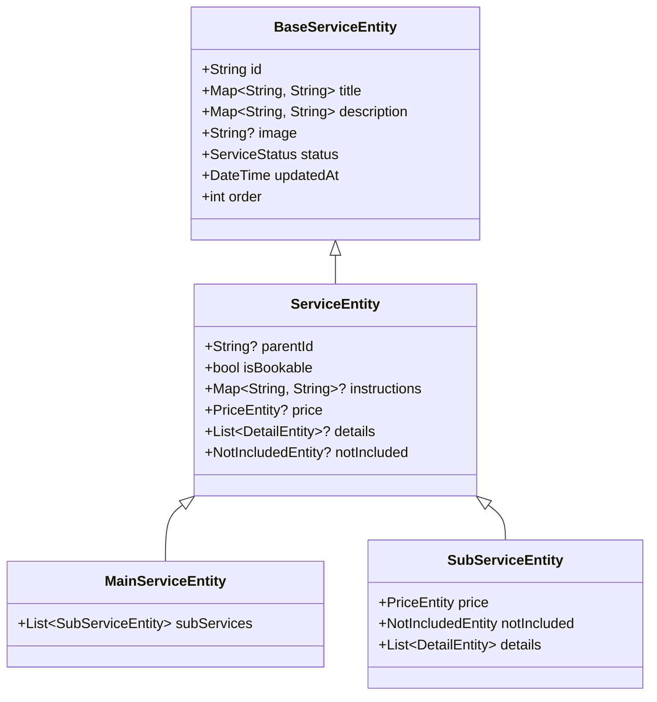

# Technical Audit Report: Services Data Model & Architecture

This document presents a deep technical and business audit of the services data models in the codebase, assessing their completeness, scalability, and suitability for the upcoming UI integration.

---

## 📂 1. Model Extraction & Structures

The services system uses a unified tree-based model where both categories (non-bookable nodes) and services (bookable leaf nodes) are stored flatly and mapped to hierarchical structures.

### A. Core Entities (Domain Layer)

#### 1. `BaseServiceEntity`
The root class containing metadata shared by every node in the catalog.
* **Fields**:
  * `id` (`String`): Unique identifier (UUID).
  * `title` (`Map<String, String>`): Localized title names (keys like `ar`, `en`).
  * `description` (`Map<String, String>`): Localized description.
  * `image` (`String?`): Nullable path/URL for the service's icon or banner.
  * `status` (`ServiceStatus`): Lifecycle status enum (`draft`, `review`, `ready`, `active`, `paused`, `archived`).
  * `updatedAt` (`DateTime`): Timestamp tracking last database modification.
  * `order` (`int`): Display order sequence.

#### 2. `ServiceEntity`
Extends `BaseServiceEntity` and introduces tree hierarchies and optional booking metadata.
* **Fields**:
  * `parentId` (`String?`): References the ID of the parent category. Null for root categories.
  * `isBookable` (`bool`): Flag denoting whether this node can be added to a cart/booked.
  * `instructions` (`Map<String, String>?`): Multilingual checklist/instructions for customer booking.
  * `price` (`PriceEntity?`): Pricing configuration (nullable for categories).
  * `details` (`List<DetailEntity>?`): Inclusions and bulleted notes (nullable for categories).
  * `notIncluded` (`NotIncludedEntity?`): Explicit exclusions list (nullable for categories).

#### 3. `MainServiceEntity`
Represents a root or mid-level category node. It extends `ServiceEntity` and enforces `isBookable = false`.
* **Fields**:
  * `subServices` (`List<SubServiceEntity>`): Mapped list of child services.

#### 4. `SubServiceEntity`
Represents a bookable leaf node. It extends `ServiceEntity` and overrides core properties to guarantee they are non-nullable for the booking UI.
* **Fields**:
  * `price` (`PriceEntity`): Strictly non-nullable pricing configurations.
  * `details` (`List<DetailEntity>`): Strictly non-nullable details list.
  * `notIncluded` (`NotIncludedEntity`): Strictly non-nullable exclusions.

---

### B. Pricing Sub-Entities

#### 1. `PriceEntity`
Defines how a service calculates its booking cost.
* **Fields**:
  * `type` (`PricingMethod`): Calculation method enum:
    * `fixed`: Flat fee.
    * `perSquareMeter`: Rate based on surface area.
    * `perLinearMeter`: Rate based on length.
    * `perIssue`: Rate based on diagnostic issues.
    * `unknown`: Fallback value.
  * `value` (`num`): The base price/rate value.
  * `unit` (`String`): Unit text (e.g., "متر", "ساعة").
  * `options` (`List<PriceOptionEntity>`): Extras/Options available to add to the booking.
  * `fields` (`List<DynamicFieldEntity>`): Input structures (dropdowns, sliders) for dynamic calculations.

#### 2. `PriceOptionEntity`
Represents an selectable extra item (e.g., optional cleaning material).
* **Fields**:
  * `key` (`String?`): Option identifier.
  * `value` (`num?`): Additional price cost.
  * `label` (`Map<String, String>?`): Localized labels.

#### 3. `DynamicFieldEntity`
Defines client-side form inputs that calculate price modifiers.
* **Fields**:
  * `id` (`String`): Unique field identifier.
  * `type` (`DynamicFieldType`): Enum (`number`, `toggle`, `dropdown`, `optionsGroup`).
  * `label` (`Map<String, String>`): Localized field title.
  * `required` (`bool`): Validation constraint.
  * `min` (`num?`): Minimum numeric value constraint.
  * `unit` (`String?`): Measurement unit label.
  * `priceModifier` (`num?`): Price multiplier factor.
  * `options` (`List<DropdownOptionEntity>?`): Selection list if type is `dropdown`.

---

### C. Details Sub-Entities

#### 1. `LanguageContentEntity`
Bullet points and structured text representing rich detail.
* **Fields**:
  * `title` (`String?`): Heading of the section.
  * `icon` (`String?`): Accompanying icon name or URL.
  * `points` (`List<String>?`): Bullet points of description.

#### 2. `DetailEntity` & `NotIncludedEntity`
Wrap `LanguageContentEntity` to provide strict Arabic and English localization.
* **Fields**:
  * `ar` (`LanguageContentEntity`): Arabic content.
  * `en` (`LanguageContentEntity`): English content.

---

## 🎯 2. Business Analysis

| Business Feature | Support Status | Technical Implementation Details |
| :--- | :--- | :--- |
| **Multilingual (ar/en)** | **Fully Supported** | Titles, descriptions, option labels, dynamic fields, and details use `Map<String, String>` or structured `ar`/`en` objects. Translation is built into the schema. |
| **Multiple Images** | **Not Supported** | Currently only supports a single image URL (`image` field of type `String?`). No galleries or multiple asset collections can be stored. |
| **Bookable vs Categories** | **Fully Supported** | Managed seamlessly by tree nodes using `isBookable` and `parentId`. Handled by the client-side tree builder. |
| **Dynamic Pricing** | **Fully Supported** | Handled via `DynamicFieldEntity` (Dropdowns, toggles, number inputs with custom `priceModifier` multipliers). |
| **Options & Extras** | **Fully Supported** | Handled via `PriceOptionEntity` records inside `PriceEntity.options` to support supplementary items. |
| **Complex Services** | **Fully Supported** | Inclusions and exclusions are structured natively via nested `DetailEntity` and `NotIncludedEntity`. |

---

## ⚙️ 3. Technical Analysis

### A. Scalability (High)
* **Client-Side Tree Compiling**: The flat SQLite/Hive storage fetches flat lists. The repository builds the adjacency list tree cache on the fly. This eliminates recursive SQL join loops on the server and loads instantly.
* **Network efficiency**: The sync uses lightweight delta checks (`updated_at > lastSync`), minimizing Supabase server overhead.

### B. Flexibility (Moderate)
* **Unified Model**: Categories and services share the same `services` table. This makes introducing mid-level categories easy (adding a sub-category is just a node with `isBookable = false` and `parentId` pointing to a root category).
* **Coupling**: The system uses separate `ServiceRemoteModel`, `ServiceHiveModel`, and `ServiceEntity` classes. While clean from a Clean Architecture perspective, adding a new field requires modifications across 6 files and running codegen (`build_runner`).

---

## ⚠️ 4. Current Issues & Limitations

1. **Single Image Restriction**: 
   - *Issue*: Visual catalog items often require multiple images (e.g., detail page banner, step-by-step illustrations, gallery). The current `String? image` is restricted to one URL.
2. **Dynamic Field Options Typing**: 
   - *Issue*: `DropdownOptionEntity` uses `Map<String, String> label` for translation, while `PriceOptionEntity` uses `Map<String, String>? label`. This minor mismatch in nullability can cause inconsistencies during mapper generation.
3. **No Metadata JSON field**:
   - *Issue*: The database has no open metadata JSON field. If we want to add arbitrary key-value pairs (e.g. tagging a service as "Popular", "Winter Special", or "Express"), we must modify the database schema instead of reading from an open metadata column.

---

## 🛠️ 5. Recommendations

### Action level: Minor Fixes & Feature Additions
No core redesign or heavy refactoring is required. The architecture is solid and clean. We only need minor adjustments to finalize the "data contract" before writing UI code.

### Actionable Proposals:
1. **Extend Image to List of Images**:
   - Update `image` in `BaseServiceEntity` to `images` (`List<String>`).
   - If backward compatibility is needed, retain `image` as the thumbnail/first element and add `images` for the carousel.
2. **Add Metadata Map**:
   - Add a `Map<String, dynamic>? metadata` field to `ServiceEntity`. This allows storing tags, promotional flags, or badges without database schema changes later.
3. **Sync Optimization**:
   - Proceed to UI integration immediately after confirming if multiple images/metadata are required by business needs.
