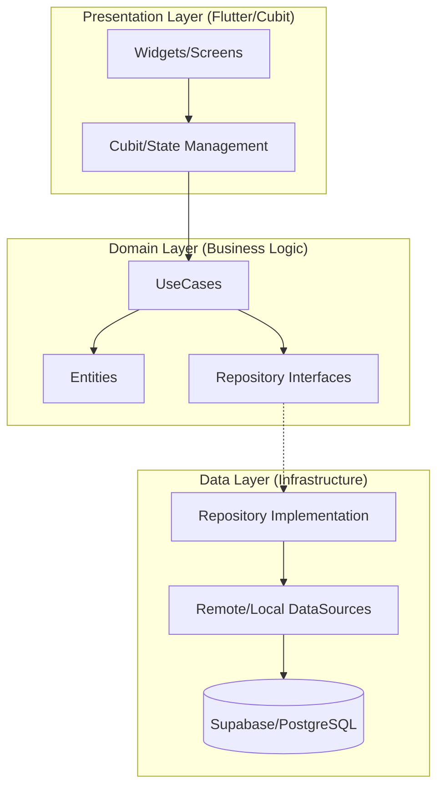

# Fresh Home - System Architecture Documentation

Welcome to the **Fresh Home** technical documentation. This document serves as the primary reference for the system architecture, business logic, and developer onboarding for the Fresh Home monorepo.

---

## 1. Project Overview

**Fresh Home** is a professional service-on-demand platform designed to connect customers with specialized technicians (e.g., window cleaning, maintenance).

### Apps Included
*   **Customer App**: Search services, book technicians, track orders in real-time.
*   **Staff (Technician) App**: View assigned tasks, update job progress, manage availability.
*   **Admin Dashboard**: Global oversight, manual overrides, user management, and performance reporting.

### Backend Stack
*   **Supabase**: PostgreSQL database, Authentication, Real-time subscriptions, and Edge Functions (PostgreSQL Functions / RPCs).
*   **FCM (Firebase Cloud Messaging)**: Push notifications across all apps.

### Architecture Style
The project follows **Clean Architecture** principles to ensure modularity, testability, and independence from external frameworks.

---

## 2. System Architecture

The core logic is centralized in the `shared` and `shared_features` packages using a three-layer approach.

### Layers
1.  **Presentation Layer**: Flutter widgets, Cubits (BLoC), and UI state management.
2.  **Domain Layer**: Pure business logic (Entities, UseCases, Repository Interfaces). **Highest Stability.**
3.  **Data Layer**: Implementation of repositories, DataSources (Supabase, Local Storage), and API Models.

### Mermaid Diagram

---

## 3. Booking Lifecycle

Bookings follow a strict state machine to ensure data integrity and auditability.

| Status | Description |
| :--- | :--- |
| `created` | Initial state before payment/confirmation. |
| `assigning` | System is finding the best technician. |
| `assigned` | Technician found and notified. |
| `accepted` | Technician has confirmed they will attend. |
| `on_the_way` | Technician is traveling to the customer location. |
| `in_progress` | Work has started on-site. |
| `completed` | Work finished and verified. |
| `cancelled` | Order revoked by Customer, Admin, or Technician. |
| `reassigned` | Moved from one technician to another. |
| `rescheduled`| Date/time changed by Admin. |

### Transitions
Transitions are atomic and handled via the `transition_booking` RPC to prevent race conditions.

---

## 4. Smart Assignment Engine

The heart of the system is the **Smart Assignment Engine**, which balances load and quality.

### Selection Logic
1.  **Specialty Check**: Filters technicians capable of the specific sub-service.
2.  **Availability**: Matches against the technician's scheduled hours and existing bookings.
3.  **Capacity Logic**: Ensures a technician isn't double-booked for the same time slot.
4.  **Load Balancing**: Prioritizes technicians with fewer bookings for the day if ratings are equal.
5.  **Auto Assignment**: If no technician is manually selected, the system picks the highest-rated available staff member automatically.

---

## 5. Transition Engine

All order state changes pass through the **Transition Engine** (`transition_booking` RPC).

*   **Role-Based Access**: Only Technicians can move an order to `in_progress`. Admins can transition any order.
*   **Audit Logs**: Every transition automatically creates a entry in `booking_logs` and `assignment_logs`, capturing the "Who, What, When" for historical auditing.

---

## 6. Realtime System

Fresh Home uses **Supabase Real-time Streams** to keep apps in sync.

*   **watchBooking**: Use cases provide `Stream<Booking>` to UI, allowing instant updates when a technician moves or status changes.
*   **Timeline Updates**: The order detail screen reconstructs the timeline dynamically from `booking_logs`.

---

## 7. Notification System

A multi-channel notification engine powered by FCM and Supabase.

*   **Database Trigger**: New entries in the `notifications` table trigger background processes.
*   **FCM Integration**: Tokens are managed via `FcmTokenManager`, registered upon login, and deleted on logout.
*   **Notification Center**: A centralized screen in `shared` to view historical notifications across apps.

---

## 8. Admin Dashboard

Admins have "Super Power" override capabilities over any booking.

*   **Override Logic**: Manual reassignment if a technician is unavailable.
*   **Rescheduling**: Direct modification of the `scheduled_at` field with automatic notification to all parties.
*   **Conflict Resolution**: View technicians' global schedule to resolve overlap issues.

---

## 9. Database Structure

Key tables and their roles:

*   **`bookings`**: Stores core order data, status, and snapshots of service/address.
*   **`booking_logs`**: Immutable history of status transitions.
*   **`assignment_logs`**: History of who was assigned and when.
*   **`notifications`**: User-specific alerts and unread counts.
*   **`technicians`**: Profiles, ratings, and active status.
*   **`services` / `sub_services`**: Service catalog definition.

---

## 10. Clean Architecture Rules

1.  **Dependency Rule**: Outer layers depend on inner layers. `Data` depends on `Domain`. `Domain` depends on NOTHING.
2.  **UseCases Only**: UI must NEVER call a Repository directly. Use a UseCase for every user action.
3.  **Entities**: Data models must be converted to Domain Entities before reaching the Cubit.

---

## 11. Current System Capabilities

*   ✅ **Auto Assignment**: Zero-touch technician matching.
*   ✅ **Real-time Synchronization**: Instant data parity across apps.
*   ✅ **End-to-End Audit**: Full visibility into order history.
*   ✅ **Integrated FCM**: Bulletproof notification delivery.
*   ✅ **Role Security**: Strict separation of Admin/Staff/Customer access.

---

## 12. Future Extension Points

*   **Ratings & Reviews**: Post-completion feedback loop.
*   **Payments**: Stripe/HyperPay integration.
*   **Reports**: PDF generation for performance and accounting.
*   **Analytics**: Demand heatmaps for city-based services.
*   **SLA Tracking**: Alerts if an order isn't `accepted` within X minutes.

---

## 13. Architecture Audit

### Scorecard
| Metric | Score | Notes |
| :--- | :---: | :--- |
| **Architecture** | 9/10 | Clean Architecture well-enforced. Monorepo structure is robust. |
| **Scalability** | 8/10 | RPC-based logic scales well, but may need Edge Functions for complex batching. |
| **Performance** | 8/10 | Supabase Realtime is fast. Snappy UI due to BLoC. |
| **Security** | 9/10 | RLS policies and JWT-based Auth provide strong isolation. |

### Areas for Improvement (Issues Log)
*   **Logic Distribution**: Some business logic is in SQL (RPCs) and some in Dart. We should clearly document SQL-side logic.
*   **Cache Management**: Local storage (Hive) is used but needs a more robust "force refresh" strategy for stale metadata.
*   **UI Consistency**: Unified design system is in `shared`, but some ad-hoc styles exist in apps.

---

**Last Updated**: 2026-03-30
**Owner**: Fresh Home Tech Team
